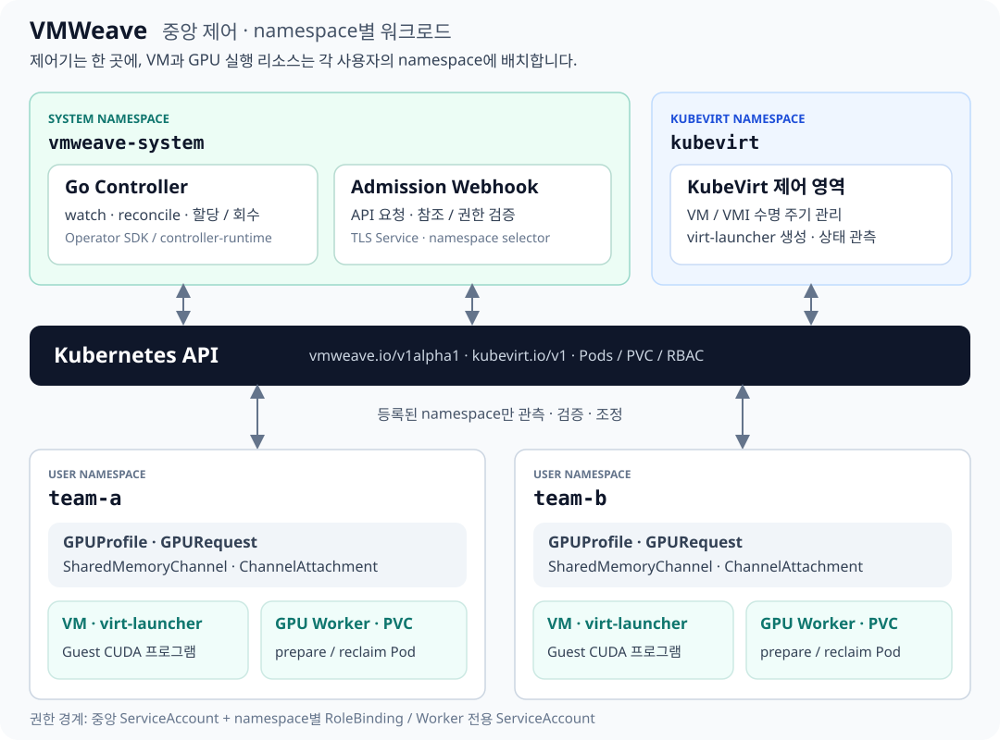

# VMWeave-GPU

**Kubernetes가 관리하는 가상머신을 위한 공유 메모리 기반 GPU 실행·공유 시스템.**

VM의 CUDA 호출을 공유 메모리(SHM) 채널로 Worker에 전달하고, Kubernetes 리소스로
할당과 수명 주기를 관리합니다. GPU 자원 제한에는 HAMi를 사용합니다.
Flyt/Cricket 기반 실험에서 출발했으며, 현재 기본 실행 경로는 SHM 전용입니다.

[문서 사이트](https://WoogiBoogi1129.github.io/VMWeave-GPU/) ·
[설치](docs/getting-started/index.md) · [아키텍처](docs/architecture/index.md) ·
[실험 결과](docs/evaluation/index.md) · [개발 안내](CONTRIBUTING.md)



## 현재 상태

연구·개발 단계입니다. 실제 VM의 SHM GPU 실행, 제한된 FP32 eager MLP·SGD,
두 VM의 서로 다른 메모리 한도와 정상 회수를 검증했습니다.
전체 CUDA/PyTorch 호환성, 전체 장애 시험 및 HA 운영은 완료되지 않았습니다.

2026-09-30 시작 실험에서 N/T/S를 경로별 5회·총 105개 구간 측정했습니다.
**현재 SHM 경로는 8개 호출·전송 지표 모두 TCP 경로보다 평균 지연이 컸습니다.**
단일 VM 상한 25·50·75는 각각 5회 모두 사전 이용률 기준을 초과했습니다.
전송 방식 외에 정책·실행기 차이가 포함되며, 상한 결과는 해당 빌드·GPU·부하 범위입니다.
[지원·검증 현황](docs/overview/status.md)과 [새 성능 평가](docs/evaluation/resource-performance.md)를 확인하세요.

## 시작하기

모든 명령은 저장소 루트에서 실행합니다. 문서만 확인할 때 GPU는 필요하지 않습니다.

```sh
python3 -m venv .local/docs-venv
.local/docs-venv/bin/pip install -r requirements-docs.txt
.local/docs-venv/bin/mkdocs serve
```

- 중앙 설치: [관리자 설치](docs/getting-started/install.md) → [namespace 등록](docs/getting-started/namespaces.md) → [첫 VM](docs/getting-started/first-vm.md)
- 기존 배포: [새 API 이전](docs/guides/migrate-to-vmweave-api.md)
- CPU 환경: [제어기 설치와 검증](docs/getting-started/cpu-control-plane.md)
- GPU 환경: [요구 조건과 준비 순서](docs/getting-started/gpu.md)
- 소스 검증: [빌드·테스트](docs/development/index.md)
- 기존 자료: [개발 이력과 출처](docs/history/index.md)

## 저장소 구성

| 경로 | 역할 |
|---|---|
| `operator/` | 중앙 Go Controller·Webhook, `vmweave.io` API |
| `runtime/shm/` | Guest, Worker, Python 호환 helper, SHM 계약·큐·CUDA 디스패처 |
| `charts/`, `deploy/`, `images/` | Helm, CRD·예제, 이미지 빌드 |
| `scripts/`, `tests/` | 빌드·설치·검증 도구 |
| `experiments/` | 실험 실행·수집·분석 및 원본 증거 |
| `docs/` | 현재 문서 사이트의 원본 |
| `legacy/` | 이전 RPC 구현과 역사 문서 |
| `artifacts/`, `results/`, `.local/` | 로컬 산출물; Git 포함 범위는 각 안내 참조 |

[전체 파일 관리 정책](docs/development/repository.md) · [증거 보존 정책](docs/evaluation/artifacts.md)

## 출처와 인용

원본 저작권과 MIT 라이선스는 [LICENSE](LICENSE), 프로젝트 계보와 의존성은
[NOTICE](NOTICE) 및 [출처 문서](docs/history/provenance.md)를 따릅니다.
이름 변경은 기존 코드의 출처 변경을 뜻하지 않습니다.
논문 제목·저자·DOI가 확정되기 전에는 저장소 URL과 사용 커밋 SHA를 인용하세요.
