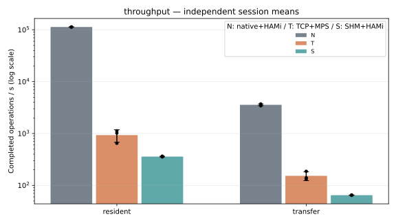

# N/T/S 오버헤드 비교 — 2026-09-29 기록

후속 Go Operator 실험은 [2026-09-30 시작 성능 평가](resource-performance.md)에 있습니다.
해당 후속 N/T/S 결과는 경로별 5회·105구간입니다. 아래 수치는 과거 프로토콜의 원본이며 후속 결과와 합산하지 않습니다.

**당시 SHM 구현의 성능 우위는 확인되지 않았습니다.**
2026-09-29 공개 결과에서 호출·전송 지표 9개 모두 S의 평균 지연이 T보다 컸습니다.
개선 구현을 새로 비교한 [2026-10-01 전체 시스템 결과](resource-performance.md#shm-tcprpc)는 별도 실험입니다.

| 경로 | 구성 |
|---|---|
| N | 호스트 컨테이너의 직접 CUDA + HAMi |
| T | VM → Flyt RPC/TCP → GPU Cell → MPS |
| S | VM → SHM → Worker → HAMi |

## 결과

유효 비교는 경로별 3회, 총 63개 구간입니다. 독립 세션별 평균을 집계했으며
호출별 표본을 독립 반복으로 세지 않습니다. 6회 확장 반복 계획은 중단됐습니다.

| 지표 | N | T | S |
|---|---:|---:|---:|
| 메모리 조회 반환, µs | 5.979 | 800.728 | 1,489.474 |
| 작은 커널 launch+sync, µs | 7.901 | 1,674.622 | 2,834.760 |
| H2D 4 MiB, µs | 256.658 | 3,773.735 | 12,580.965 |
| resident 작업/초 | 113,238.323 | 931.186 | 358.767 |
| transfer 작업/초 | 3,572.189 | 152.784 | 64.640 |

위 표는 평균을 요약한 것입니다. 표준편차·세션별 수치·제외 기준은 원본 보고서를 따릅니다.

[전체 결과·표준편차·원본 링크](../../experiments/evidence/results/2026-09-29-overhead/README.md) ·
[재현 절차](../../experiments/evidence/results/2026-09-29-overhead/REPRODUCE.md)

## 해석의 한계

- N도 HAMi를 사용하는 기준이며 순수 native와 같지 않습니다.
- T의 MPS와 N/S의 HAMi, 큐·직렬화·동기화·빌드 최적화 차이가 함께 포함됩니다.
- N/S의 PTX와 T의 cubin은 같은 계산·입력 조건이나 동일 기계어를 보장하지 않습니다.
- 당시 Worker의 empty-queue 대기는 원인 후보였으며 이 실험에서 기여도를 분리 측정하지 않았습니다.
- 결과를 SHM 전송 매체만의 효과 또는 모든 CUDA/AI 작업으로 일반화할 수 없습니다.

추가 N 6구간과 제외된 초기 조회 3구간도 원본에 보존돼 있습니다.
후속 최적화는 새 커밋·동일 비교 조건의 새 실험으로 검증해야 합니다.
