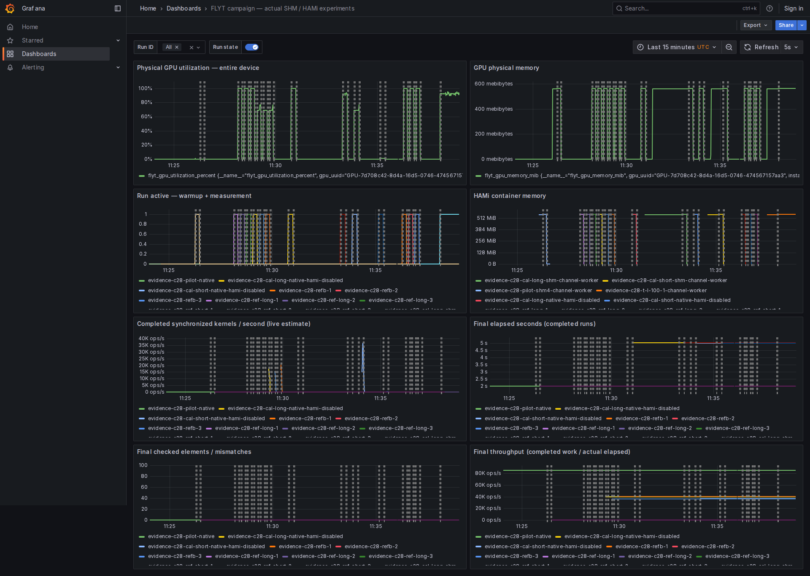
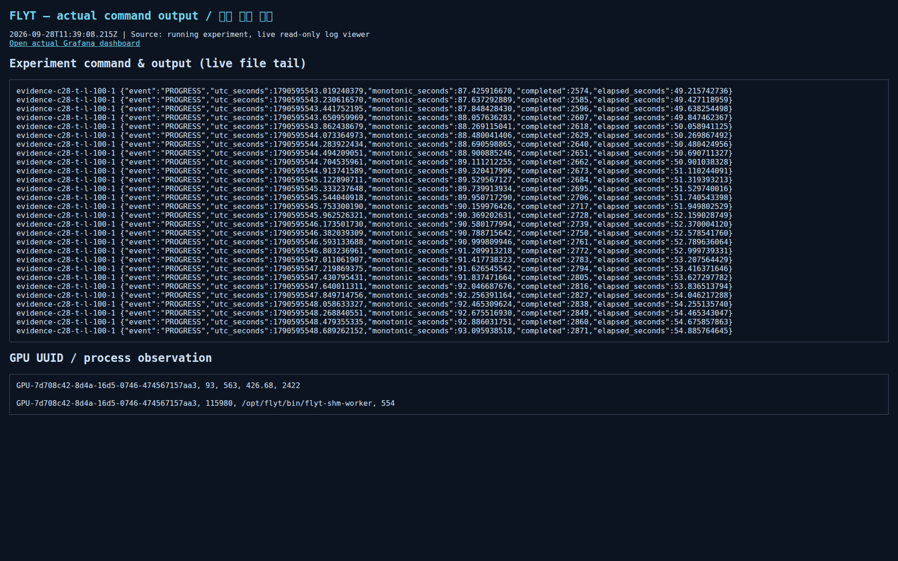
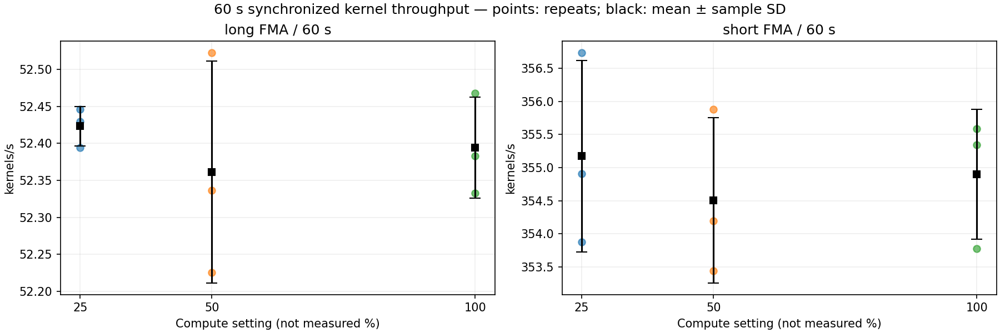
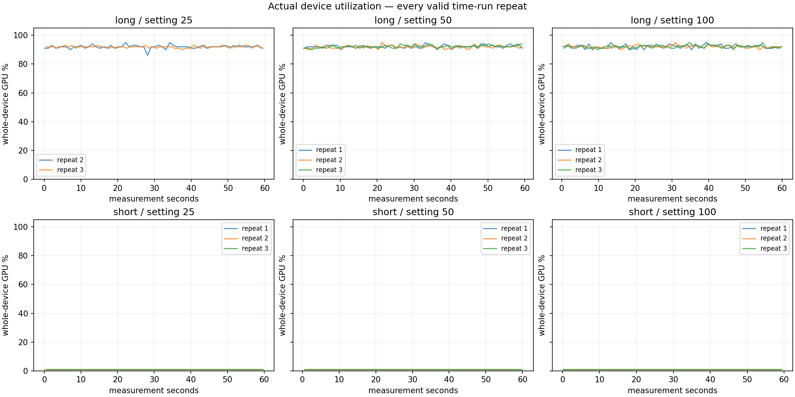
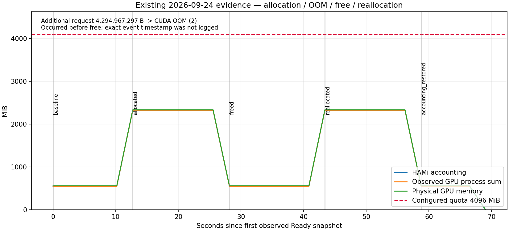

# 시각 자료가 확보된 실험 결과

2026-09-28 공개 범위: **60초 시간제 실험 18회와 실제 Grafana 캡처·영상**, 그리고 9/22·9/24 기존 결과의 보조 그림.
고정 작업량 실험은 중단했으며 이 묶음에 포함하지 않는다. 오버헤드·공유 간섭의 정식 비교는 실행하지 않았다.
아래 결과는 전체 개발 gate 통과나 연산 제한 정책의 유효성 판정을 뜻하지 않는다.

전체 자료 위치와 주장 가능한 범위는 [시각 자료 목록](../../VISUAL_EVIDENCE_INVENTORY_2026-09-28.md)에 정리했다.

## 실제 실행 화면과 영상

9/28 긴 커널 설정 100의 실제 Grafana 화면이다. [약 42초 영상](captures/compute-100-1/page@9c728d5dd81b508a129c27f9a6c01d83.webm),
[캡처 메타데이터](captures/compute-100-1/compute-100-1-capture.json), [당시 관측 원본](captures/compute-100-1/compute-100-1-snapshot.json)을 함께 보존했다.



`Run ID = All`이므로 기준 생성·예비 실행도 함께 보인다. 설정별 성능 비교에는 아래 18회 그래프를 사용한다.
다음은 실제 stdout을 읽는 브라우저 뷰어 화면이다. 데스크톱 터미널 직접 녹화가 아니며,
캡처에는 `PROGRESS`까지만 보이므로 최종 정확성 판정은 실행별 `metrics.json`과 `stdout.jsonl`에서 확인한다.



설정 25에도 [Grafana 화면](captures/compute-25-1/compute-25-1-grafana-end.png)과
[약 27초 영상](captures/compute-25-1/page@d60fe252ee9c042b4d31cdbb2ff66eed.webm)이 있다.
설정 50과 모든 반복의 전용 실시간 영상은 없다.

## 60초 시간제 측정: 18회 완료

동일한 CUDA 프로그램으로 긴/짧은 커널 × 연산 설정 25/50/100 × 각 3회를 실행했다.
각 실행은 VM 1개, Worker 1개, 메모리 4096 MiB, 세션 1개, 공유 메모리 64 MiB 조건이다.
2048 blocks × 256 threads의 FMA 커널이며 내부 반복은 long 1,048,576 / short 1,024다.
준비 실행은 최소 10초 및 50개 커널이고, 본 측정은 60초 동안 kernel+sync를 반복한다.
처리율은 단조 시계로 측정한 실제 경과시간과 동기화 완료 횟수로 계산한다.

| 커널 | 설정 | 반복 수 | 처리율 평균 ± 표본 표준편차 (kernels/s) | GPU 전체 이용률 평균 |
|---|---:|---:|---:|---:|
| long | 25 | 3 | 52.423 ± 0.027 | 91.94% (유효 2회) |
| long | 50 | 3 | 52.361 ± 0.150 | 92.07% (3회) |
| long | 100 | 3 | 52.394 ± 0.068 | 92.12% (3회) |
| short | 25 | 3 | 355.172 ± 1.448 | 1.00% (3회) |
| short | 50 | 3 | 354.507 ± 1.250 | 1.00% (3회) |
| short | 100 | 3 | 354.902 ± 0.981 | 1.00% (3회) |





- 각 실행의 마지막 FP32 출력 524,288개를 기준 결과와 비교했다. **18/18회 불일치 0·비유한값 0**, 회수 기록도 18/18회다. 매 커널 출력 전수를 검사했다는 의미는 아니다.
- 허용 기준은 `abs(got-ref) <= 1e-6 + 1e-4 * abs(ref)`다. 기준 출력은 동일 입력의 native 실행으로 생성했으며 [long](protocol/reference-long-hashes.json)·[short](protocol/reference-short-hashes.json) 각각 3회 해시 확인 자료를 보존했다.
- 긴 커널의 첫 설정 25 실행은 guest UTC step 때문에 GPU 시계열 대응이 불확실하여 이용률 평균과 시계열 그림에서 제외했다. 단조 시계 기반 처리율은 유효하여 3회 모두 포함했다. 대체 실험은 실행하지 않았다.
- 이용률은 GPU 전체 기준이며, 약 1초 표본의 실제 간격으로 가중 평균했다. 이 결과는 25/50/100에 비례한 연산 제한을 입증하지 않는다. 제한 정책 판정은 `NOT_EVALUATED`다.
- [실행별 CSV](tables/runs.csv), [평균·표준편차·범위](tables/compute-summary.csv), [집계 상태](tables/analysis-status.json), [실행별 원본](runs/)을 제공한다.

## 기존 실험: 실제 화면이 확보된 결과

아래 화면은 **9/24에 수집한 실제 명령 출력 기반 대시보드**이며 Grafana나 9/28 신규 실행으로 표기하지 않는다.

| 실험 | 실제 화면·영상 | 보조 그래프와 범위 |
|---|---|---|
| 두 VM의 동일 GPU 공유 | [화면](../2026-09-24-showcase/screenshots/two-vm-gpu-sharing.png), [약 73초 영상](../2026-09-24-showcase/video/two-vm-live.webm) | 두 Worker·동일 GPU UUID·동시 사용. 단독 대비 성능 간섭 비교는 아님 |
| 1 GiB 제한·복구 | [할당](../2026-09-24-showcase/screenshots/evidence-show-mem-1024-observe-allocated.png), [OOM 후 해제](../2026-09-24-showcase/screenshots/evidence-show-mem-1024-observe-freed.png), [재할당](../2026-09-24-showcase/screenshots/evidence-show-mem-1024-observe-reallocated.png) | [메모리 변화](reused/memory-1024.png) |
| 4 GiB 제한·복구 | [할당](../2026-09-24-showcase/screenshots/evidence-show-mem-4096-observe-allocated.png), [OOM 후 해제](../2026-09-24-showcase/screenshots/evidence-show-mem-4096-observe-freed.png), [재할당](../2026-09-24-showcase/screenshots/evidence-show-mem-4096-observe-reallocated.png) | [메모리 변화](reused/memory-4096.png). OOM의 정확한 발생 시각은 미기록 |
| 정상 종료·회수·재사용 | [호스트 관측 회수 화면](../2026-09-24-showcase/screenshots/additional-normal-release.png) | [20회 반복 그래프](../2026-09-24-showcase/plots/lifecycle.png), [최종 감사](../2026-09-24-showcase/final-audit.json) |
| 연산 설정별 부하 | [25](../2026-09-24-showcase/screenshots/evidence-show-compute-25-1-load.png), [50](../2026-09-24-showcase/screenshots/evidence-show-compute-50-1-load.png), [100](../2026-09-24-showcase/screenshots/evidence-show-compute-100-1-load.png) | [9회 관측 그래프](../2026-09-24-showcase/plots/compute-observed.png). 신규 18회와 반복 수를 합산하지 않음 |




보조 자료로 [PyTorch 정확성 표](reused/pytorch-correctness.png)·[CSV](reused/pytorch-correctness.csv)와
[두 세션 합산 제한 그림](reused/aggregate.png)도 포함한다. 이 둘은 결과 그림이 있지만 전용 실행 과정 화면은 부족하다.
PyTorch는 9/22의 8개 조건·144개 tensor 비교 원본이며, 합산 제한은 9/24의 각 약 2.4 GiB 요청에 `[성공, OOM]`인 결과다.
한 세션 해제 후 다른 세션의 재요청 성공까지 검증한 것은 아니다. [원본 출처와 한계](reused/provenance.json)를 참조한다.

## 재현 조건과 원본 검증

- [환경 자료](environment/): 서버 CPU·RAM·GPU, 게스트 OS, Kubernetes/KubeVirt, HAMi, NVIDIA 드라이버, QEMU, 모니터링 버전.
- 구현 출발 커밋: `75b5696fe66e478413efa7ea621a551487e986f0`. 측정은 당시 로컬 변경을 포함했다. 실행별 manifest의 해시, identity의 이미지 digest, [배포 controller digest](protocol/controller-image.txt), [바이너리 해시](protocol/artifact-hashes.json)가 실제 측정 버전을 식별한다. 이번 자료 공개 커밋을 당시 실행 버전으로 표기하지 않는다.
- [probe 소스](analysis/campaign_probe.c)는 실행 manifest의 소스 해시와 일치한다. [분석 코드](analysis/analyze_campaign.py)는 이 공개 묶음의 18회 원본에서 표와 그림을 재생성한다. 분석 코드의 공개 범위 조정 사항은 [공개 범위 기록](protocol/publication-scope.json)에 남겼다.
- [GPU 표본](samples/observations.jsonl.gz)은 공개 실행의 측정 구간 전후 5초로 한정한 원본 JSON이다. [CPU 표본](samples/cpu-observations.jsonl.gz)은 같은 구간에서 해당 실행 pod UID에 속한 프로세스만 포함한다. 고정 작업량 실행 원본과 전체 터미널 세션은 공개하지 않았다.
- [Prometheus 설정](monitoring/prometheus.yml)과 [Grafana dashboard](monitoring/dashboards/campaign.json)는 실제 화면의 계측 구성을 기록한다. 캡처가 모든 반복의 시작부터 종료까지를 담지는 않는다.

저장소 루트에서 Python과 matplotlib이 설치된 환경으로 실행한다. GPU나 클러스터 접근은 필요 없다.

```bash
python experiments/evidence/results/2026-09-28-campaign/analysis/analyze_campaign.py \
  --base experiments/evidence/results/2026-09-28-campaign \
  --output /tmp/flyt-visual-reanalysis/tables
```

결과 CSV는 지정한 `tables`에, 그림은 그 상위 `figures`에 생성된다.
배포 자료의 무결성은 이 디렉터리에서 `sha256sum -c SHA256SUMS`로 확인한다.
