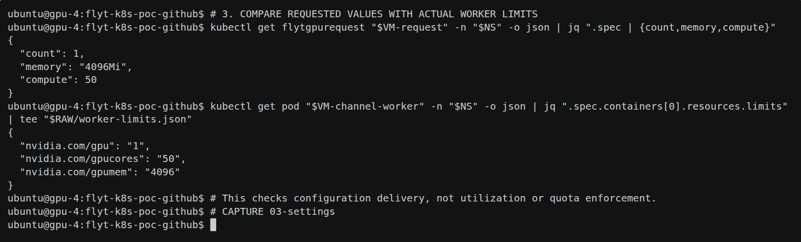
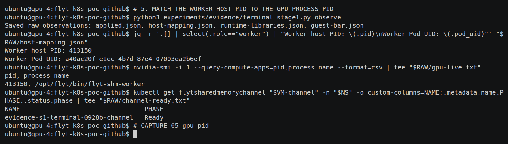
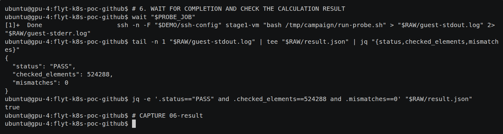

# 1단계 발표용 재시연 — 실제 터미널 명령과 로그

**자체 결과 UI를 제외하고, 실제 bash 터미널에서 1단계 실험을 다시 진행했다.**
`kubectl`·SSH·`nvidia-smi` 명령과 출력을 표준 **asciinema 2.4.0**으로 녹화했다.
요청 등록부터 회수까지 57개 명령, 145.14초, 단계별 전체 캡처 8장과 발표용 발췌 3장이다.

새 시연은 **요청·배치 확인 15개 항목 통과 / 정수 524,288개 불일치 0 / 정상 회수**다.
Worker의 호스트 PID **413150**과 `nvidia-smi`에 나온 GPU 프로세스 PID가 일치했다.
GPU 1개·메모리 4 GiB·연산 설정 50의 전달을 확인했으며, 제한 효과나 성능을 판정한 실험은 아니다.

## 먼저 볼 자료

- [실제 터미널 원본 녹화(.cast)](stage1.cast) — asciinema CLI 또는 아래 표준 player로 재생
- [연속 터미널 영상(.webm)](terminal-captures/stage1-terminal-replay.webm) — 원본 녹화를 공식 player에서 1배속 재생한 영상
- [텍스트 로그](terminal.txt) — 원본 PTY 출력에서 ANSI 제어 문자를 제거한 읽기용 사본
- [실행 명령·종료 코드·시각](commands.json)
- [발표 슬라이드 배치와 설명 문장](PRESENTATION_GUIDE.md)

**① 요청값이 Worker에 적용됐는가?** 위 명령은 요청 객체, 아래 명령은 실제 Worker Pod를 조회한다.
`4096Mi ↔ 4096`, `50 ↔ 50`, `1 ↔ 1`을 읽으면 된다.



**② 그 Worker가 GPU를 사용했는가?** Worker Pod의 cgroup에서 찾은 host PID와
실제 `nvidia-smi` 출력의 PID **413150**이 같다. 이어 Channel의 `Ready` 상태를 확인한다.



**③ 계산까지 성공했는가?** VM 프로그램의 종료를 기다린 뒤 실제 마지막 출력에서
`status`, `checked_elements`, `mismatches`를 `jq`로 추출한다.



`true` 한 줄은 마지막 조건식의 검사 결과다. 근거는 그 위의 프로그램 출력과 보존한 원본이다.

## 실행 순서와 각 장면의 의미

| 단계 | 실제 수행 내용 | 캡처 | 읽을 내용 |
|---|---|---|---|
| 0 | 요청 전 VM 부재·GPU 프로세스 부재 조회 | [시작 전](terminal-captures/00-before.png) | 새로운 시연의 시작 상태 |
| 1 | VM 정의·profile·GPU 요청·channel 등록 | [요청 등록](terminal-captures/01-request.png) | GPU 1개, memory 4096Mi, compute 50 |
| 2 | VM 시작·SSH 준비·Worker 확인 | [VM·Worker](terminal-captures/02-vm-worker.png) | 해당 VM과 Worker가 gpu-4에서 실행됨 |
| 3 | 요청과 Worker limits 직접 조회 | [설정 비교](terminal-captures/03-settings.png) | 요청값과 적용값의 일치 |
| 4 | VM 안에서 실행할 명령 확인·SSH 실행 | [Guest 실행](terminal-captures/04-guest-command.png) | 프로그램·인자·실제 Guest hostname |
| 5 | Pod cgroup의 host PID와 GPU PID 대조 | [GPU 실행](terminal-captures/05-gpu-pid.png) | 같은 PID 413150, Channel Ready |
| 6 | SSH 실행 종료 대기·결과 조회 | [검산](terminal-captures/06-result.png) | 524,288개 검사, 불일치 0 |
| 7 | UID 확인 후 drain·회수 조회 | [종료·회수](terminal-captures/07-released.png) | Released, VMI/Worker 부재, GPU 프로세스 없음 |

초기 준비 스크립트가 VM 정의·profile·요청·channel을 등록하며, VM 시작도 별도 명령이다.
GPU 요청 객체 하나만 등록하면 이 모든 객체가 자동 생성된다고 설명하지 않는다.
2단계의 프로세스 준비와 5단계의 Guest 연결 완료(Ready)를 구분한다.

이 녹화는 에이전트가 실제 bash에 단계별 명령을 입력한 실행 기록이다. 사람이 직접 입력한
이력으로 주장하지 않는다. 터미널 prompt·명령 출력·결과값을 그림으로 만들어 넣지 않았다.
PNG와 WebM은 **공식 asciinema-player 3.6.3이 원본 .cast를 재생한 화면의 추출물**이다.
발표용 발췌는 같은 재생 화면에서 빈 하단 행만 제외한 캡처다. [발췌 영역](slide-excerpts/metadata.json)을 보존했다.
공식 player의 JS/CSS를 수정하지 않았고 원본 녹화의 출력·시각도 편집하지 않았다.
[캡처 시점](chapters.json), [재생·캡처 메타데이터](terminal-captures/metadata.json)를 함께 보존한다.

## 원본 근거

| 확인 사항 | 원본 |
|---|---|
| 생성 명령과 실제 생성 결과 | [prepare.sh](raw/prepare.sh), [create.log](raw/create.log) |
| 요청과 적용값 | [request-values.json](raw/request-values.json), [worker-limits.json](raw/worker-limits.json), [전체 관측값](raw/applied.json) |
| VM·Worker 배치 | [vmi.txt](raw/vmi.txt), [worker.txt](raw/worker.txt), [identity.json](raw/identity.json) |
| Worker host PID·공유 backing | [host-mapping.json](raw/host-mapping.json) |
| 실제 GPU 프로세스 | [gpu-live.txt](raw/gpu-live.txt), [gpu-processes.csv](raw/gpu-processes.csv) |
| HAMi 실제 라이브러리·프로세스 설정 | [runtime-libraries.json](raw/runtime-libraries.json) |
| Guest BAR2 매핑 | [guest-bar.json](raw/guest-bar.json) |
| VM 실행 명령·stdout·stderr | [run-probe.sh](raw/run-probe.sh), [stdout](raw/guest-stdout.log), [stderr](raw/guest-stderr.log) |
| 계산 결과 | [result.json](raw/result.json) |
| 회수 | [cleanup.json](raw/cleanup.json), [Released Channel](raw/released-channel.json), [읽기 전용 backing 감사](backing-audit.json) |
| 판정 | [15개 관측 검사](raw/checks.json), [오프라인 검증](offline-verification.json) |

Worker PID 추적 보조 스크립트는 지정 Pod UID의 cgroup과 `/proc`를 읽는다. 원본 전체를 저장한 뒤
터미널에서는 `jq`로 필요한 값만 표시했다. 빈 GPU 프로세스 목록은 CUDA 사용 프로세스 부재를 뜻한다.
GPU memory 할당 한도의 효과나 커널 실행 순간의 이용률을 이 PID 목록으로 판정하지 않는다.

## 조건·기존 결과와의 관계

- 새 VM 이름: `evidence-s1-terminal-0928b`. VM 8 vCPU / RAM 16 GiB, session 1개, SHM 64 MiB.
- GPU: `GPU-7d708c42-8d4a-16d5-0746-474567157aa3`, memory 4096 MiB, compute 50.
- 프로그램: 기존 정수 probe, grid 2048×256, 내부 덧셈 64회, 준비 실행 10초 이상·50회 이상 뒤 45초 실행.
  seed 2030이며 최종 출력 524,288개를 검사했다. 원본의 처리율 필드는 성능 비교에 사용하지 않는다.
- 기존 1단계와 같은 Worker/Guest 라이브러리·probe 바이너리를 사용했다. 이미지·해시·기준 커밋은
  [protocol.json](protocol.json), 실행·기록 도구는 [sources/](sources/)에 보존했다. GPU 런타임 코드는 수정하지 않았다.
- [기존 3회 결과](../2026-09-28-stage1/README.md)는 유지한다. 이번 1회는 발표용 절차 시연으로 별도 기록하며 반복 수를 합산하지 않는다.
- [2단계 결과](../2026-09-28-stage2/README.md)는 원본 Guest/Worker 로그를 핵심 자료로 안내하도록 수정했다. 2단계 GPU 실험을 다시 실행하지 않았다.

첫 시연은 백그라운드 SSH가 stdin을 읽다 SIGTTIN으로 정지해 `wait`가 149를 반환했다.
자동 회수 fallback의 import 누락도 발견해 수정하고, 해당 UID를 확인한 회수를 명시적으로 실행했다.
첫 시도의 [원본·오류·회수 기록](failures/attempt-1/)은 보존했다. `ssh -n`을 적용한 새 VM의
이번 실행은 완료됐다. **새 시연 시도 2개 중 완료 1개·중단 1개**이며 중단을 성공에 포함하지 않는다.

기존 basic-vm의 UID·Running 상태는 [실행 전](raw/baseline-vmis.json)과 [실행 후](raw/final-vmis.json)가 같다.
두 시연의 VMI/Worker는 회수했고 backing 디렉터리는 비었으며 감사 Pod도 삭제했다.

## 재생과 검증

이 디렉터리에서 다음 명령을 실행하면 외부 서비스 업로드 없이 표준 player로 재생할 수 있다.

```sh
python3 -m http.server 9901 --bind 127.0.0.1
# 브라우저에서 http://127.0.0.1:9901/ 열기
# asciinema CLI가 있으면: asciinema play stage1.cast
```

저장소 루트에서 원본 관측값과 녹화의 연결을 다시 검사한다.

```sh
python3 experiments/evidence/verify_terminal_stage1.py experiments/evidence/results/2026-09-28-stage1-terminal
cd experiments/evidence/results/2026-09-28-stage1-terminal
sha256sum -c SHA256SUMS
```

새 GPU 시연을 실행하려면 `record_stage1_terminal.py`의 NAME·BASE·PUBLIC을 새 경로로 지정하고,
asciinema 2.4.0과 pexpect 4.9.0이 있는 venv를 준비한다. 현재 환경의 해제된 PVC와 기존 helper를 사용한다.
이미 존재하는 VM 이름이나 공개 경로는 덮어쓰지 않는다. 공개하지 않은 SSH 키·cloud-init은 `.local`에 있다.

[asciinema 공식 문서](https://docs.asciinema.org/manual/),
[공식 player 설치 방법](https://docs.asciinema.org/manual/player/quick-start/),
[동봉 player 라이선스](asciinema-player/LICENSE).
