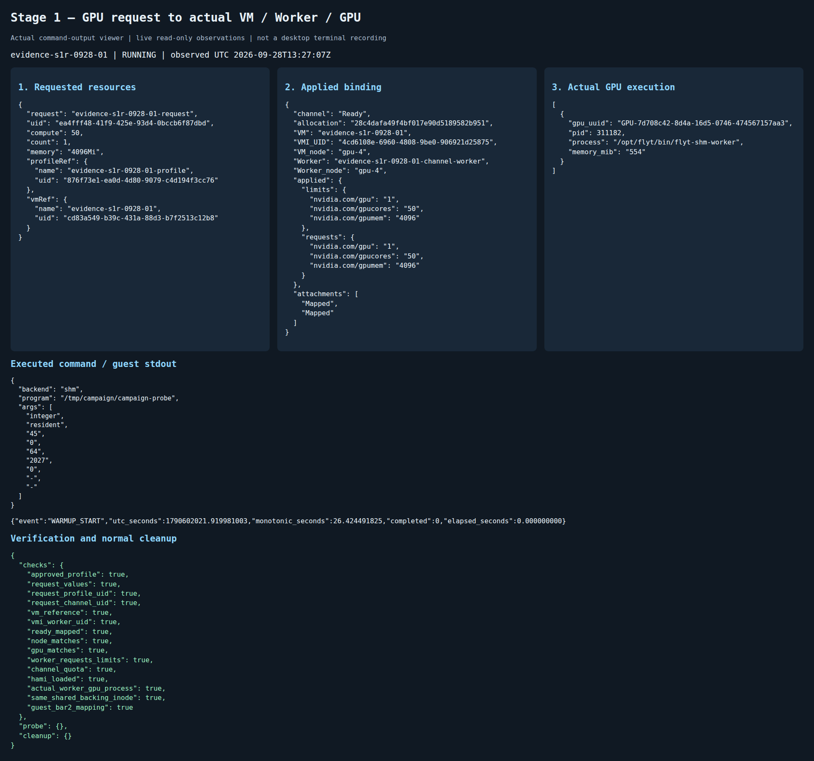
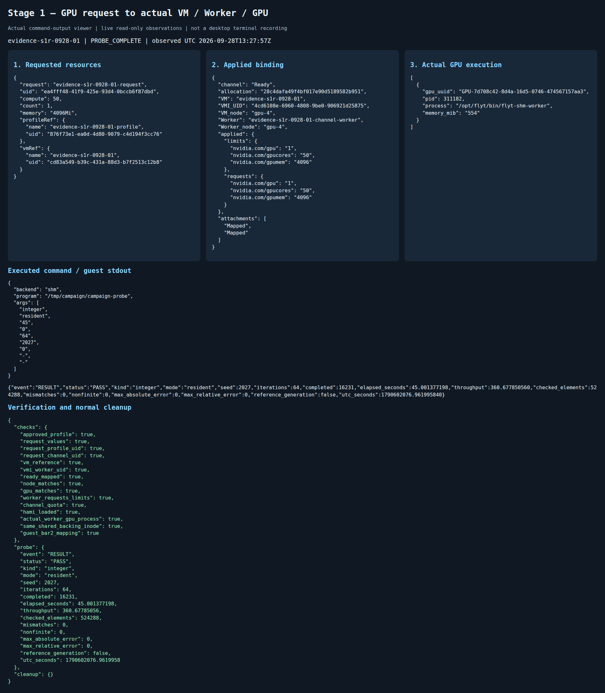

# 1단계 결과 — GPU 요청과 실제 실행 경로 연결

2026-09-28 실행. **독립 allocation 3/3회에서 요청·배치·공유 영역·실제 GPU 실행·정상 회수를 확인했다.**
최초 준비 시도 1회는 실행 파일 권한 오류로 실패했으며 [실패 원본](failures/)을 별도로 보존했다.
이는 전체 시도 4회 중 유효 GPU 실행 3회이며, 서비스 성공률이나 성능 실험 성공률로 표현하지 않는다.

이번 범위는 [발표자료 계획](../../THESIS_V3_EXPERIMENT_PLAN.md)의 **1단계 I1**이다.
GPU 경로 확인을 위해 기존 정수 probe를 사용했다. 2단계의 요청 ID별 양쪽 추적,
연산 이용률 제한, 성능 비교, TCP 비교는 실행하지 않았다.

## 결과와 실제 화면

| 반복 | Allocation 앞 12자리 | Worker / QEMU host PID | 같은 backing inode | 검산 원소 / 불일치 | 배치·실행·회수 |
|---|---|---|---|---|---|
| 1 | `28c4dafa49f4` | 311182 / 311494 | 60577786 | 524,288 / 0 | PASS |
| 2 | `b5361f0ba1d6` | 323380 / 323607 | 60577802 | 524,288 / 0 | PASS |
| 3 | `289e0bdf0e65` | 334767 / 334951 | 60577818 | 524,288 / 0 | PASS |

전체 UID·generation·프로세스·GPU 연결은 [placement.csv](placement.csv),
개별 검증은 [verification.json](verification.json), 실행 집계는 [summary.json](summary.json)에 있다.





- [첫 실행 연속 영상](captures/stage1-first-run-live.webm): 약 131초, 1920×1440. 새 VM 준비부터 실제 매핑·검산·회수까지의 관측 화면을 녹화했다.
- [첫 실행 회수 화면](captures/evidence-s1r-0928-01-RELEASED.png)
- [두 번째 실행](captures/evidence-s1r-0928-02-MAPPED.png), [검산](captures/evidence-s1r-0928-02-PROBE_COMPLETE.png), [회수](captures/evidence-s1r-0928-02-RELEASED.png)
- [세 번째 실행](captures/evidence-s1r-0928-03-MAPPED.png), [검산](captures/evidence-s1r-0928-03-PROBE_COMPLETE.png), [회수](captures/evidence-s1r-0928-03-RELEASED.png)

화면은 실제 Kubernetes·호스트 조회와 guest stdout을 표시하는 **읽기 전용 브라우저 뷰어**다.
Grafana나 데스크톱 터미널 녹화라고 표기하지 않는다. 각 PNG와 같은 이름의 JSON에 화면의 관측값·시각을 보존했다.
회수 화면 상단 binding/GPU 패널은 마지막 실행 중 관측값이고, 하단 cleanup은 이후 회수 결과다.
각 조회는 순차 수행되므로 원자적 동시 snapshot이 아니며 `snapshots.jsonl`의 수집 시작·종료 시각을 함께 사용한다.

## 무엇을 확인했는가

| 항목 | 실제 확인 내용 | 근거 |
|---|---|---|
| 요청·승인 | 승인 profile, GPU count 1, memory 4096Mi, compute 50 | 실행별 request.yaml / profile.json |
| 적용값 | Worker requests/limits GPU 1·gpumem 4096·gpucores 50, Channel 값도 일치 | applied.json |
| 실제 프로세스 설정 | CUDA_DEVICE_MEMORY_LIMIT_0=4096m, CUDA_DEVICE_SM_LIMIT=50 | runtime-libraries.json |
| 배치 | VM/VMI와 Worker 모두 gpu-4, 요청·profile·Channel·실행 객체 UID 연결 | placement.csv / identity.json |
| 실제 GPU | 세 실행 모두 GPU-7d708c42-8d4a-16d5-0746-474567157aa3, host GPU PID가 해당 Worker cgroup에 속함 | applied.json / host-mapping.json |
| HAMi 적용 경로 | 실제 Worker에 libvgpu.so와 NVIDIA CUDA 라이브러리 mapping·파일 해시 확인 | runtime-libraries.json |
| 공유 파일 | QEMU와 Worker에서 같은 allocation 파일의 device·inode가 같고 rw-s 매핑 | host-mapping.json |
| 게스트 접근 | ivshmem BDF 0000:00:1e.0, BAR2 64 MiB, 실제 probe의 resource2 매핑 | guest-bar.json / layout-summary.json |
| 준비 상태 | Channel Ready, 두 attachment Mapped 및 현재 generation 확인 | applied.json |
| GPU 프로그램 | 출력 524,288개 최종 검산, 모든 실행 mismatch 0 | metrics.json / stdout.jsonl |
| 회수 | Released, 해당 VMI·Worker 부재, GPU process 목록 비어 있음 | cleanup-audit.json / channel-final.json |

메모리 4 GiB·연산 50은 **요청과 실제 설정 전달**을 확인한 값이다. 이번에 한도 초과·이용률 상한을 시험한 것은 아니다.
`GPU_CORE_UTILIZATION_POLICY`는 실제 프로세스에서 미지정이었다. 연산 제한 판정은 `NOT_EVALUATED`다.
inode 숫자는 파일 삭제 뒤 재사용될 수 있으므로 실행 간 inode의 유일성을 주장하지 않는다. 같은 실행의 양쪽 mapping 대응을 검증했다.

## 재현 조건과 구현 버전

- VM당 8 vCPU / RAM 16 GiB, digest 고정 guest 이미지, 1세션 / SHM 64 MiB.
- VM CPU 0–7, Worker CPU 16–19로 배치했다. 독점 코어 예약·strict NUMA memory binding을 의미하지 않는다.
- 정수 probe: 2048 blocks × 256 threads, 원소별 64회 덧셈, 입력·출력 각 2 MiB.
  준비 실행 최소 10초·50회 후 45초 실행. 마지막 출력만 CPU 정수 기준과 전수 비교했다.
  seed는 2027/2028/2029다. 커널 횟수·처리율은 실행 원본으로 보존하지만 이 자료를 정식 성능 결과로 사용하지 않는다.
- 각 실행의 manifest·identity·runtime-libraries에 source/binary 해시, 이미지 참조, 실제 라이브러리를 기록했다.
- [제어기·webhook 이미지](control-images.json), [실행 시 소스 해시](source-hashes.json), [보존 소스](sources/).
  출발 commit은 7e058bccbc56b19e939e6442c852130e347ac03b이며 로컬 추가 실험 도구를 사용했다.
  배포 controller는 기존 f8c839… digest이고, helper image와 다른 값이다. 미커밋 controller 소스의 실제 배포 파일 해시 일치는 별도 기록한다.

뷰어에 표시된 기존 `command.json`의 program 필드는 `/tmp/campaign/campaign-probe`라는 축약 메타데이터다.
실제로 실행된 바이너리는 `campaign-probe-guest`이며, 정확한 전체 명령은 각 실행의
`executed-command.txt`와 `host-events.jsonl`의 COMMAND 이벤트에 그대로 보존했다.

## 최초 준비 실패와 범위

`evidence-s1-0928-01`은 로컬 artifact 복사 시 executable bit를 보존하지 않아 guest에서 exit 126으로 종료했다.
CUDA 실행 전의 준비 실패다. 정상 drain·Released·실행 객체 부재·GPU process 부재를 확인했다.
원본 artifact의 실행 권한을 복원하고 새 이름 `evidence-s1r-0928-01..03`으로 다시 실행했다.
실패 결과를 덮어쓰거나 세 성공 실행의 반복 수에 포함하지 않았다.

기존 basic-vm의 UID와 Running 상태는 [실행 전](existing-vmis-before.json)과 [실행 후](existing-vmis-after.json) 동일하다.
기존 다른 실험의 객체와 host-PID helper는 보존했다. 정상 종료된 이번 VM 정의·Channel·프로파일·요청은 재검토용으로 남겼다.
실행 후 [읽기 전용 PVC 감사](backing-audit.json)에서 backing 디렉터리가 비어 있음을 확인했고, 해당 감사 Pod도 삭제했다.

공개 runner에는 이후 실행을 위한 executable-bit 사전 검사와 정확한 command 메타데이터 이름을 보완했다.
이번 측정에서 로드한 소스는 `sources/`의 보존본이며, 공개 runner의 후속 보완이 과거 실행에 적용됐다고 주장하지 않는다.

## 원본 재검증

저장소 루트에서 GPU·클러스터 접근 없이 실행한다.

```bash
python3 experiments/evidence/verify_stage1.py experiments/evidence/results/2026-09-28-stage1
python3 -m unittest discover -s tests/control -p test_stage1_evidence.py -v
```

배포된 파일의 SHA-256 검증은 이 디렉터리에서 `sha256sum -c SHA256SUMS`로 수행한다.
SSH 키·cloud-init·전체 Pod 환경변수·private preparation은 공개하지 않는다.
