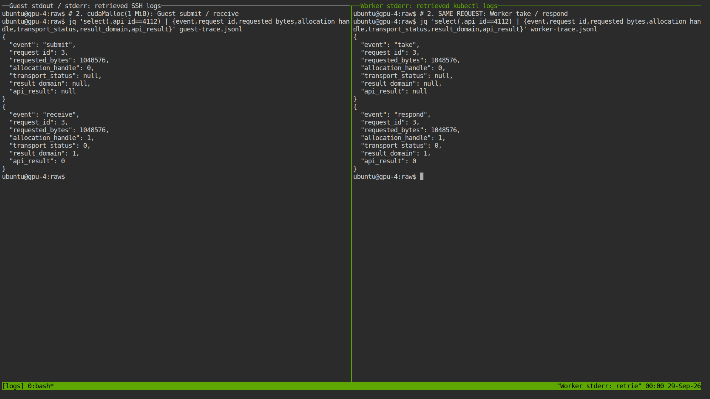
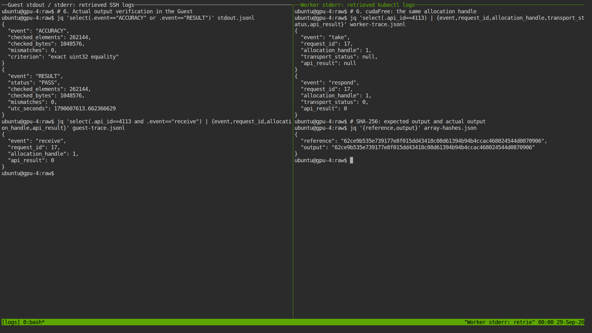

# 2단계 재실험 — 실제 로그와 정적 터미널 캡처

**새 VM에서 대표 실행 1회 PASS.** Guest가 요청한 메모리 할당 → 입력 복사 → GPU 커널 실행·동기화 → 출력 회수 → 검산 → 해제가 Worker까지 전달되고 응답되는 것을 확인했다. 정수 **262,144개 중 불일치 0개**, 전체 **18개 요청·72개 추적 레코드**가 대응했다.

이번 자료는 **녹화·동영상 없이** 실제 bash/tmux에서 원본 로그를 조회한 **PNG 7장**과 로그·CSV·출력 데이터로 구성한다. 브라우저에는 표준 [ttyd 1.7.7](https://github.com/tsl0922/ttyd/releases/tag/1.7.7) 터미널을 그대로 표시했다. 자체 결과 UI는 사용하지 않았다.

화면은 **실험 종료 후 수집한 로그를 조회하는 실제 터미널의 정적 캡처**다. CUDA 실행 순간을 찍은 live 화면이나 녹화 재생 화면은 아니다. 명령은 스크립트가 실제 셸에 입력했다. 사람이 수동으로 입력했다고 주장하지 않는다. `jq`는 저장된 레코드의 항목을 선택해 표시하며, 원본은 별도로 보존한다.

실험 준비는 2026-09-28 KST, CUDA 실행은 **9/28 23:59:57–9/29 00:00:13 KST**, 정상 회수는 **9/29 00:00:33 KST**다. 디렉터리 이름은 준비 시작 날짜를 따른다. [이전 독립 실행 3회](../2026-09-28-stage2/README.md)와 이번 대표 실행 1회를 구분하며, 이번 화면이 기존 세 번의 실행을 촬영한 것처럼 사용하지 않는다.

## 발표에서 보여 줄 순서

각 화면에서 **왼쪽은 Guest 로그, 오른쪽은 Worker 로그**다. 양쪽 모두 호스트 셸에서 수집 파일을 읽는다. `submit`은 Guest 요청 제출, `take`는 Worker 수신, `respond`는 Worker 응답, `receive`는 Guest 응답 수신이다. 같은 request ID를 따라 읽는다.

| 순서 | 정적 터미널 화면 | 실제 관측과 발표 설명 |
|---|---|---|
| 1 | [프로그램·배치 식별](terminal-captures/01-program-binding.png) | 실제 Guest 실행 명령, seed 2031, 1 MiB, allocation·session·GPU UUID 확인 |
| 2 | [메모리 할당 요청 왕복](terminal-captures/02-malloc-roundtrip.png) | request **3**: 1,048,576 bytes 요청, Worker 응답 및 Guest 수신 성공, handle **1** 반환 |
| 3 | [입력을 GPU로 복사](terminal-captures/03-h2d.png) | request **6**: 같은 handle 1에 H2D **1 MiB** 전송, 양쪽 결과 0 |
| 4 | [커널 실행과 완료 동기화](terminal-captures/04-kernel-sync.png) | request **10**: `cuLaunchKernel`, **11**: `cudaDeviceSynchronize`, 모두 성공 |
| 5 | [출력 회수](terminal-captures/05-d2h.png) | request **13**: handle 1에서 D2H **1 MiB**, 응답 데이터 길이 1,048,576 bytes |
| 6 | [계산 검산·해제](terminal-captures/06-accuracy-free.png) | 정수 262,144개 mismatch **0**, 기준·출력 SHA-256 동일, request **17**의 handle 1 해제 성공 |
| 7 | [독립 재검증·회수](terminal-captures/07-cleanup-verification.png) | 원본 추적·출력 byte 재검증 PASS, Channel Released, 실험 VMI·Worker 소멸, 기존 VM 보존 |

**핵심 1 — Guest의 할당 요청과 Worker 응답을 같은 ID로 확인:**



**핵심 2 — 실제 계산 결과와 메모리 해제 확인:**



발표용 문장과 화면별 읽는 방법은 [PRESENTATION_GUIDE.md](PRESENTATION_GUIDE.md)에 정리했다. 각 PNG 옆의 `*-guest.txt`, `*-worker.txt`는 그 시점의 터미널 화면 텍스트다. [명령과 종료 코드](terminal-captures/commands.json), [캡처 UTC·도구 버전](terminal-captures/metadata.json)도 제공한다.

## 재현 조건

| 항목 | 이번 실제 조건 |
|---|---|
| 실행 식별자 | `evidence-s2-static-0928`; 새 VM·Worker·allocation·session 각 1개 |
| VM / 공유 영역 | 기존 검증 Guest 이미지, 8 vCPU·16 GiB RAM, 64 MiB SHM |
| GPU | 물리 GPU 4개 중 GPU 1 한 개, `GPU-7d708c42-8d4a-16d5-0746-474567157aa3` |
| GPU 자원 요청 | 4096 MiB, compute 50, session 1개; 이번에는 제한 강제 여부를 평가하지 않음 |
| CPU 배치 | Guest 0–7, Worker 16–19; NUMA 메모리 강제 고정 없음 |
| 프로그램 | 기존 [stage2_probe.c](sources/stage2_probe.c), C/PTX, PyTorch 미사용 |
| 입력 / 기준 | `input[i]=2031+i`, `reference[i]=input[i]+19`; uint32 완전 일치, 허용 불일치 0 |
| 작업 | 단일 1 MiB allocation, H2D → add 19 커널 → synchronize → D2H → 전수 검산 → free |
| 커널 / 반복 | 1024 blocks × 256 threads, 커널 1회, 별도 warmup 없음, 대표 실행 1회 |
| 대기 / 추적 | 기존 probe의 단계 사이 4초 대기 유지, Guest·Worker trace ON; 시간 성능 실험 아님 |
| 실제 Worker 라이브러리 | Driver 580.173.02, libcudart 12.8.90, libvgpu 해시는 [runtime-libraries.json](raw/runtime-libraries.json) |
| 실행 기준 커밋 | `188ca58ccbf77e3570c8793d3bac165767a00c63`; 기존 Stage 2 바이너리·Worker 이미지 재사용 |

[protocol.json](protocol.json)에 probe·Guest library 해시와 Worker 이미지 digest를 고정했다. [기존 빌드 근거](../2026-09-28-stage2/build/source-manifest.json), [이번 적용 객체](raw/applied.json), [배치 식별자](raw/identity.json), [새 도구 소스 해시](source-hashes.json)를 함께 확인한다. 기존 로컬 제어기 변경은 이번 커밋·배포 대상이 아니다.

## 원본과 검증

| 자료 | 파일 |
|---|---|
| 실제 실행 명령과 실행 출력 | [command.json](raw/command.json), [execution.txt](execution.txt) |
| Guest 원본 stdout / stderr | [stdout.jsonl](raw/stdout.jsonl), [guest-stderr.txt](raw/guest-stderr.txt) |
| Worker 원본 `kubectl logs` | [worker-stderr.txt](raw/worker-stderr.txt) |
| 추적 레코드 추출본 | [Guest JSONL](raw/guest-trace.jsonl), [Worker JSONL](raw/worker-trace.jsonl) |
| 요청별 네 지점 대응 | [requests.csv](raw/requests.csv), [validation.json](raw/validation.json) |
| 실제 출력 1 MiB·기준 해시 | [output.bin.gz](raw/output.bin.gz), [array-hashes.json](raw/array-hashes.json) |
| 실행 중 Worker host PID·라이브러리 | [runtime-libraries.json](raw/runtime-libraries.json), [gpu-processes.csv](raw/gpu-processes.csv) |
| 정상 회수와 보존 확인 | [Released Channel](raw/released-channel.json), [cleanup.json](raw/cleanup.json), [final-audit.json](raw/final-audit.json) |
| backing PVC 읽기 전용 확인 | [backing-audit.json](backing-audit.json): 빈 디렉터리, 점검 Pod 삭제 완료 |
| 묶음 검증·무결성 | [bundle-check.json](bundle-check.json), [SHA256SUMS](SHA256SUMS) |

원본 stderr에서 `FLYT_TRACE ` 접두어를 가진 행의 JSON만 그대로 추출했다. 추출본에 값을 추가하거나 결과를 재작성하지 않았다. 검증기는 추출본 대신 **원본 stderr와 실제 출력 byte**를 읽는다.

이번 18개 요청은 CUDA Runtime/Driver 요청 **10개**, HELLO **1개**, HEARTBEAT **6개**, GOODBYE **1개**다. 모든 요청에 대해 allocation·generation·session·request ID와 네 지점의 API/입력 크기를 대조했고 응답의 transport status·result domain·API result·출력 크기가 일치했다. 모든 응답의 transport status와 API result는 0이다. `flytRegisterKernelABI`는 Guest 내부 등록이므로 원격 요청 수에 넣지 않는다.

GPU 프로세스 관측의 host PID **467915**가 실제 Worker의 `/proc` 관측 PID와 일치한다. GPU 프로세스 사용량 **552 MiB**는 컨텍스트 등을 포함하므로 애플리케이션의 1 MiB 요청량과 구분한다.

### 실행 중 처리한 준비 문제

Worker 이미지가 노드 캐시에 없어 처음에는 ImagePullBackOff였다. 보관된 OCI archive를 다시 import했고 **동일 digest**의 Worker가 시작된 뒤 CUDA 프로그램을 실행했다. 빌드·입력 변경이나 CUDA 실행 재시도는 없었다. [Pod 이벤트](preparation-events.json), [준비 기록](preparation.json), [이미지 import 출력](image-import.txt)을 보존한다. 준비 실패 상태를 계산 실패나 성공 횟수에 포함하지 않는다.

### 오프라인 확인과 화면 재생성

저장소 루트에서 실행한다. 오프라인 검증에는 Kubernetes나 GPU가 필요하지 않다.

```sh
python3 experiments/evidence/verify_stage2.py \
  experiments/evidence/results/2026-09-28-stage2-static/raw
cd experiments/evidence/results/2026-09-28-stage2-static
sha256sum -c SHA256SUMS
```

실제 재실행 도구는 [run_stage2_logs.py](../../run_stage2_logs.py)다. 기존 클러스터·이미지·PVC와 비공개 SSH 키/바이너리 배치가 필요하며, 상세 선행 환경은 [기존 재현 절차](../2026-09-28-stage2/REPRODUCE.md)를 따른다. 실행 예시는 다음과 같다. `NEW`는 사용하지 않은 이름과 경로로 바꾼다. 키는 저장소에 포함하지 않는다.

```sh
python3 experiments/evidence/run_stage2_logs.py \
  --base .local/stage2-static-NEW \
  --output experiments/evidence/results/stage2-static-NEW \
  --name evidence-s2-static-NEW
```

화면 도구 [capture-stage2-static.cjs](../../../../scripts/capture-stage2-static.cjs)는 Playwright·tmux·jq 및 비공개 작업 경로의 `ttyd` 실행 파일을 사용한다. 저장된 로그를 실제 bash에서 읽고 PNG만 저장한다. `ttyd`는 `127.0.0.1:9902`에 읽기 전용으로 바인딩하고 종료 시 전용 tmux 서버와 함께 닫는다. 동일 명령으로 다시 캡처하면 캡처 시각은 달라지므로 기존 결과를 덮어쓰지 말고 별도 복사본에서 수행한다.

## 주장 범위

이 결과는 선택한 CUDA 함수들의 **SHM 요청 왕복과 정수 계산 정확성**을 입증한다. 커널 launch 응답과 GPU 작업 완료는 구분하며 별도 synchronize 성공을 확인했다. request ID 비교에는 동일 allocation·generation·session이 전제다. Guest와 Worker의 서로 다른 시계를 빼서 단방향 지연을 계산하지 않는다.

요청 제출/수신 레코드에는 응답 결과가 아직 없으므로 화면의 일부 필드는 `null`이다. `respond`와 `receive`의 **0**이 성공 결과다. allocation handle **1**은 중계용 식별자이며 실제 GPU 포인터 주소가 아니다.

연산 설정 50의 실제 제한, 4 GiB 메모리 경계, 두 VM 공유, TCP 대비 성능 오버헤드는 이번 실험의 판정 범위에 포함하지 않는다. 이전 자료의 녹화본은 과거 기록으로 유지하며 이번 묶음에는 녹화 파일·영상·GIF가 없다.
