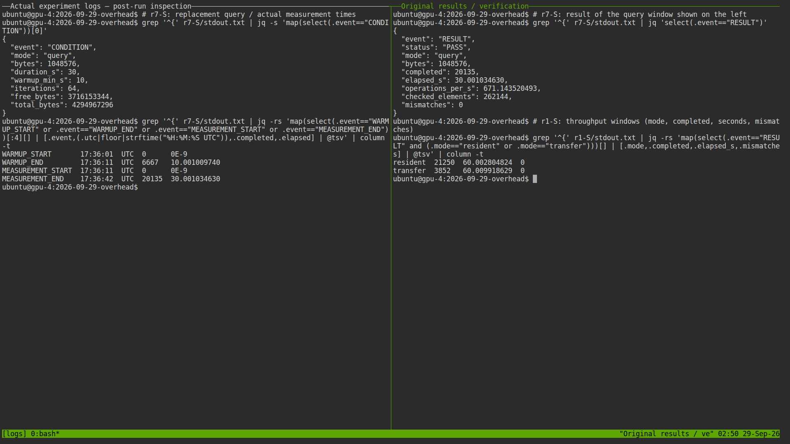
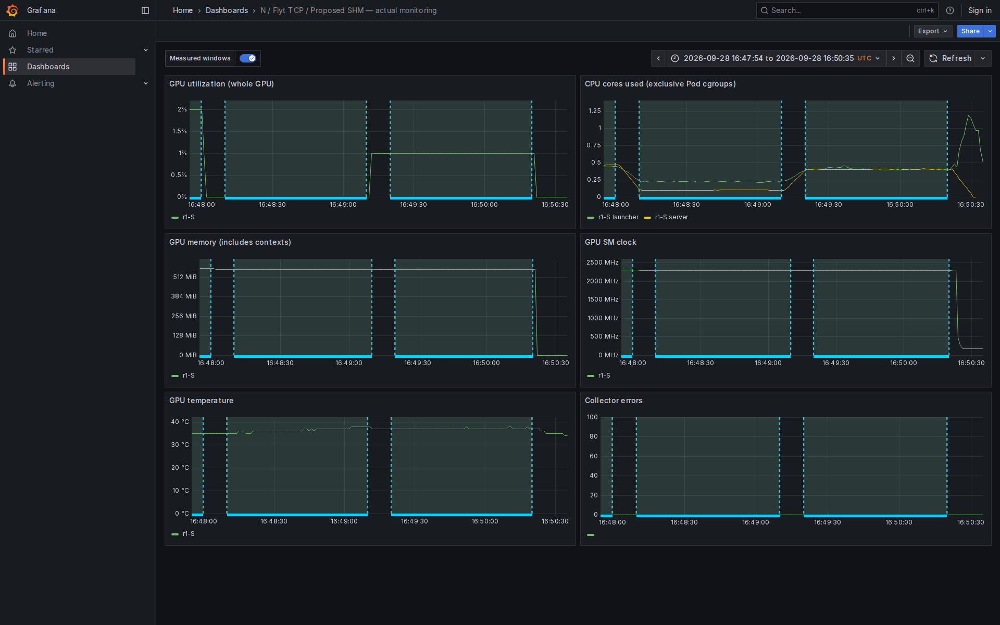

# 현재까지의 오버헤드 비교 — 호스트 직접 / Flyt TCP / 제안 SHM

**N/T/S 각 3회의 유효 비교 63개 구간을 공개한다. 확장 반복 계획 전체는 미완료다.**
사용자가 현재까지 결과만 공개하도록 요청하여 추가 실험을 중단했다.
[공개 시점과 중단 기록](publication-cutoff.json)에 따라, 본표는 조건별 세 경로의
반복 수를 맞춘 결과다. 이미 완료된 **추가 N 6개 구간**은
[별도 원본·검산·통계](additional-native/README.md)에 모두 보존했다.
이 추가 세션에 대응하는 T/S 세션은 실행하지 않아 본 비교표에 합치지 않았다.
전체 보존 원본은 **72개 구간 = 본 비교 63개 + 제외된 초기 조회 3개 + 추가 N 6개**다.
수집된 결과의 검증 PASS와 계획 전체의 완료를 구분한다.

본 비교 구간의 실행 기간은 **2026-09-29 01:30:56 KST–2026-09-29 02:36:42 KST**다.
본 비교 묶음의 원본 측정 구간은 66개이며,
초기 조회 비교 3개 구간은 [제외·대체 기록](exclusions.json)에 따라 집계에서 제외했다.
측정 중 화면 미리보기가 S의 첫 조회 구간과 겹쳤으므로 N/T/S 조회 묶음을
새 세션 `r7-*`에서 다시 측정했다. 원래 데이터도 삭제하지 않았다.
호출별 표본을 독립 반복으로 세지 않고, 새로 만든 세션별 통계를 집계했다.
초기 비교와 조회 대체 측정 뒤 사전 변동성 규칙이 6개 조건에서 발동했다.
[반복 결정 기록](extension-decision.json)에 따라 6회까지 확장할 예정이었으나
사용자 요청으로 중단했다. 따라서 현재 결과는 3회 반복의 변동성을 그대로 포함한
중간 결과이며 6회 검증을 완료한 결론으로 제시하지 않는다.

현재 구현에서는 **9/9개 호출·전송 지표에서 S의 평균 지연이 T보다 컸다.**
이 결과는 현재 SHM 구현의 성능 우위를 입증하지 않는다. 구현을 유리하게 바꾸거나
느린 표본을 제외하지 않았다. 준비 중 발견한 기존 Flyt 호환성 문제와 수정은
[별도 준비 기록](preflight/README.md)에 보존하며 성능 집계에서 제외했다.

## 비교 조건

| 경로 | 실제 실행 경로 | 자원 정책 |
|---|---|---|
| N | 호스트 컨테이너에서 직접 CUDA + HAMi | 메모리 4 GiB, 설정 100, 실제 limiter `DISABLE` |
| T | Ubuntu VM → Flyt RPC/TCP → GPU Cell → MPS | 메모리 4 GiB, 물리 188 SM 적용 |
| S | Ubuntu VM → 64 MiB SHM → Worker → HAMi | 메모리 4 GiB, 설정 100, 실제 limiter `DISABLE` |

- 같은 GPU 1: `GPU-7d708c42-8d4a-16d5-0746-474567157aa3`.
- T/S는 같은 guest 이미지, 8 vCPU / 16 GiB. 단일 애플리케이션·세션.
- Guest/직접 실행 CPU 0–7, Worker/RPC/MPS CPU 16–19, 수집 CPU 48–51.
  NUMA 메모리를 강제 고정하지는 않았다.
- C/CUDA 정수 커널이며 PyTorch를 사용하지 않았다. 모든 애플리케이션은 공통 소스 `-O2`.
- 조건마다 최소 10초 **및** 50회 준비 실행. 조회·커널·복사 각 30초,
  resident/transfer 각 60초. 실제 완료 횟수와 실제 경과 시간을 사용한다.
- 동일 프로세스의 `CLOCK_MONOTONIC`, outstanding 1. 측정 루프에 로그·CSV I/O 없음.
  호출별 표본은 메모리에 저장한 뒤 측정 종료 후 기록한다. 상세 trace는 비활성화했다.
- 완료 확인 API는 세 경로 모두 `cudaDeviceSynchronize`. launch 반환과 완료를 구분한다.
- CPU/GPU 클록을 잠그지 않았다. GPU 클록·온도·사용량과 Pod CPU counter를 1초마다
  기록했다. CPU 주파수 시계열은 없으며 [CPU 주파수 정책 스냅샷](cpu-frequency-policy.json)을 제공한다.

[고정 프로토콜·소스/바이너리 해시](protocol.json) · [실제 빌드 조건](build-conditions.json) ·
[서버·CPU/NUMA 배치](host-environment.json) · [GPU 목록](gpu-inventory.csv) · [전체 조건 검증](bundle-validation.json)

## 호출·전송 지연

단위 **µs**, **독립 세션 평균의 평균 ± 표본 표준편차**다.
`n`은 경로별 독립 세션 수다. S/T가 1보다 크면 이 지표에서 S가 더 느리다.
조회에 사용한 1 MiB 버퍼는 검산 준비용이며 조회 API의 전송 payload 크기가 아니다.

| 측정 경계 | n | N | T | S | S/T |
|---|---:|---:|---:|---:|---:|
| 메모리 조회 반환 | 3 | 5.979 ± 0.926 | 800.728 ± 31.215 | 1,489.474 ± 7.685 | 1.86× |
| 작은 커널 launch 반환 | 3 | 1.483 ± 0.019 | 848.714 ± 88.009 | 1,429.337 ± 7.296 | 1.68× |
| 작은 커널 launch+sync 완료 | 3 | 7.901 ± 0.029 | 1,674.622 ± 174.424 | 2,834.760 ± 18.992 | 1.69× |
| H2D 4 KiB | 3 | 7.151 ± 0.716 | 1,729.692 ± 182.582 | 2,843.482 ± 36.677 | 1.64× |
| D2H 4 KiB | 3 | 8.523 ± 0.964 | 1,751.033 ± 181.871 | 2,851.694 ± 37.174 | 1.63× |
| H2D 256 KiB | 3 | 22.905 ± 0.056 | 2,375.020 ± 143.160 | 3,478.232 ± 55.271 | 1.46× |
| D2H 256 KiB | 3 | 27.251 ± 0.140 | 2,164.670 ± 149.647 | 3,456.831 ± 27.321 | 1.60× |
| H2D 4 MiB | 3 | 256.658 ± 13.973 | 3,773.735 ± 1,177.396 | 12,580.965 ± 641.020 | 3.33× |
| D2H 4 MiB | 3 | 260.870 ± 14.050 | 3,888.745 ± 1,385.490 | 11,160.913 ± 516.983 | 2.87× |

복사는 pageable host buffer이며 H2D+동기화, D2H+동기화를 각각 측정했다.
작은 커널은 1 MiB / 1024 blocks × 256 threads / 내부 반복 1회다.
[실행별 median·p95·p99·유효 전송률](latency-summary.csv)을 별도로 제공한다.
p99는 해당 실행의 호출 표본 1,000개 이상일 때만 표시하며 주 지표로 사용하지 않는다.
[N 기준 지연 증가율·T 대비 S 개선율 원표](comparison.csv)에는 음수 개선율도 그대로 기록했다.

## 시간제 처리율

단위 **완료 작업/초**, **평균 ± 표본 표준편차**다.
2 MiB / 2048 blocks × 256 threads / 내부 반복 64회.
resident는 커널+완료 확인, transfer는 H2D→커널+완료 확인→D2H 전체를 1회로 센다.
고정 횟수 작업의 총 실행시간 실험은 재개하지 않았다.

| 작업 | n | N | T | S | S/N 유지율 | S/T 처리율 |
|---|---:|---:|---:|---:|---:|---:|
| resident | 3 | 113,238.323 ± 365.379 | 931.186 ± 250.006 | 358.767 ± 6.009 | 0.317% | 0.385× |
| transfer | 3 | 3,572.189 ± 144.330 | 152.784 ± 29.649 | 64.640 ± 0.571 | 1.810% | 0.423× |

[실행별 완료 횟수·경과 시간·CPU core-seconds](window-summary.csv)에서 확인할 수 있다.
CPU는 native Pod 또는 VM launcher + GPU server/Worker의 **서로 겹치지 않는 Pod cgroup**을
합산했다. Guest CPU를 QEMU에 다시 더하지 않았다. 1초 누적 counter를 구간 경계에
선형 보간한 관측값이므로 호출 단위 정밀 CPU 시간으로 해석하지 않는다.
일부 게스트에서 부팅 후 실제 시각 보정이 관측됐다. 모니터링·CPU 구간 정렬에는
시작·종료 로그를 **호스트가 받은 시각**을 사용하고, 단일 초기 SSH 시각차는 적용하지
않았다. 로그 전달 지연이 남는 근사 정렬이다. [시각 대응 점검](clock-alignment-audit.json)에
호스트 수신 간격·게스트 실제 시각 간격·단조 경과 시간의 차이를 모두 남겼다.
호출 지연과 처리율 계산에는 이 UTC 시각들을 사용하지 않는다.
공용 Kubernetes controller, 실험용 manager/Mongo, 모니터링 프로세스는 이 Pod 합계에
포함하지 않았다. 따라서 전체 서버의 총 CPU 비용을 뜻하지 않는다.

| 작업 | 경로 | 평균 사용 CPU 코어 | 완료 작업당 CPU µs: 평균 ± 표준편차 |
|---|---|---:|---:|
| resident | N | 1.013 | 8.942 ± 0.028 |
| resident | T | 0.888 | 1,000.724 ± 261.459 |
| resident | S | 0.310 | 864.335 ± 74.998 |
| transfer | N | 1.012 | 283.716 ± 11.305 |
| transfer | T | 1.884 | 12,526.503 ± 1,517.818 |
| transfer | S | 0.805 | 12,461.780 ± 256.748 |

[모든 조건의 CPU 비용 표](cpu-summary.csv)를 함께 제공한다.

## 실제 화면과 분석 그림

- [실제 터미널 캡처](terminal-captures/): bash/tmux/ttyd에서 원본 조건·절차·결과·검증을 조회했다.
- [실제 Grafana 캡처](grafana-captures/): 실제 Prometheus 데이터의 원래 측정 시간대를 조회했다.
- [분석 그래프 PNG/SVG](plots/): 원본 CSV에서 계산한 통계와 독립 실행별 점.
  평균±표준편차, 세션별 median/p95, 유효 전송률을 별도 그림으로 구분한다.
- [발표 배치안](PRESENTATION_GUIDE.md)과 [재현 절차](REPRODUCE.md).

**터미널은 사후 로그 확인 화면, Grafana는 사후 측정 시간대 조회 화면이다.**
라이브 실험을 녹화한 것처럼 표시하지 않는다. 녹화본·사용자 정의 결과 UI는 만들지 않았다.

## 원본과 검증

각 `r번호-N/T/S/` 폴더에 명령, 실행 stdout/stderr, 실제 라이브러리/정책,
식별 정보, 원본 호출 CSV 및 전체 GPU 출력, 정상 회수 기록이 있다.
CSV와 출력은 무손실 XZ 압축했으며 `packing.json`의 압축 전 해시로 바이트 동일성을
확인했다. `xz -dc 파일.csv.xz` 또는 Python `lzma.open`으로 읽을 수 있다.
`validation.json`은 각 출력의 모든 정수 원소와 원본 CSV 행 수를 다시 검증한 결과다.
각 작업의 검산은 측정 종료 후 1회이며 매 반복의 출력 검산을 주장하지 않는다.

| 계획에서 요구한 근거 | 실제 산출물 |
|---|---|
| 기준 구현·빌드·정책 | `protocol.json`, `build-conditions.json`, 실행별 `runtime-libraries.json` |
| TCP/SHM 실제 경로 | 실행별 `identity.json`, T의 `rpcinfo.txt`/연결 기록, S의 채널 UID·Worker 식별 |
| API·전송 지연 | 실행별 원본 `*.csv.xz`, `latency-summary.csv`, `comparison.csv` |
| 처리율·CPU 비용 | `window-summary.csv`, `aggregate-summary.csv`, `cpu-summary.csv` |
| 정확성·회수 | 전체 `*.output.bin.xz`, `validation.json`, `bundle-validation.json`, `final-audit.json` |
| 사람이 읽는 실행 증거 | `terminal-captures/`, `grafana-captures/`, `monitoring/` |

Prometheus query-range JSON, 원본 GPU/CPU 수집 기록, dashboard와 annotation JSON,
종료 후 보존한 **실제 Prometheus TSDB**는 [monitoring/](monitoring/)에 있다.
GPU 이용률·GPU 메모리는 물리 장치 전체 값이며 애플리케이션의 요청량과 같지 않다.
처리율은 각 30/60초 구간의 완료 횟수와 시간으로 산출했다. 1초별 처리율을 별도로
계측하지 않았으므로 Grafana의 GPU 이용률을 처리율 시계열로 대체하지 않는다.

## 해석 범위

1. **N은 순수 native가 아니라 직접 CUDA+HAMi 기준**이다.
2. T는 기준 Flyt 커밋 + 기존 패치 + 기록된 호환성 패치 3개다. 원본 논문의 모든
   전송 구성을 재현한 것이 아니라, 요청과 데이터가 TCP로 흐르는 구성이다.
3. T의 MPS와 N/S의 HAMi, RPC와 SHM의 큐·직렬화·동기화 구현 차이가 함께 포함된다.
   T는 보존된 Makefile 빌드 프로필, S는 CMake Release로 런타임 최적화 설정도 다르다.
4. N/S는 PTX를 로드하고 T는 같은 PTX의 sm_120 cubin을 로드한다. 커널 수학·입력·
   grid/block은 같지만 기계어가 동일하다고 주장하지 않는다. 로딩/JIT는 측정에서 제외했다.
5. 따라서 결과 전체를 **전송 매체만의 효과**로 귀속하거나, 모든 CUDA/AI 작업의 성능으로
   일반화할 수 없다. 현재 구현의 관측 결과다.
6. SHM Worker의 empty-queue 경로에는 1 ms 대기가 있다(`runtime/shm/src/worker.c`).
   지연의 원인 후보지만 이번 비교만으로 기여도를 분리 측정한 것은 아니다.

수식은 지연 증가율 `(L경로/LN−1)×100`, T 대비 S 지연 감소율 `(LT−LS)/LT×100`,
처리율 유지율 `Q경로/QN×100`이다. 음수 개선율도 그대로 해석한다.
[최종 자원 점검](final-audit.json)과 체크섬 목록으로 회수·보존 상태를 확인한다.
[중단 시점까지의 전체 실행 로그](campaign-logs/)와 [분석 처리 기록](ANALYSIS_NOTES.md)도 보존한다.
