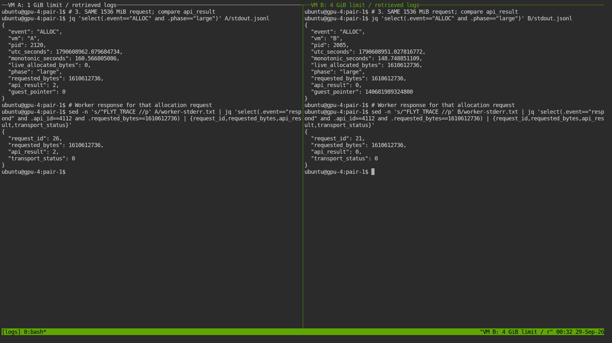
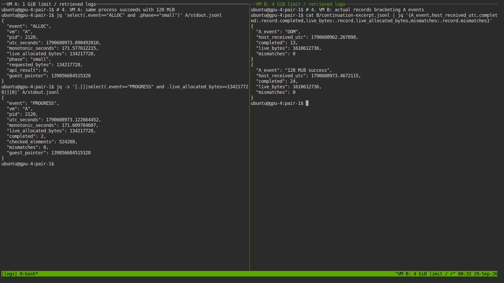
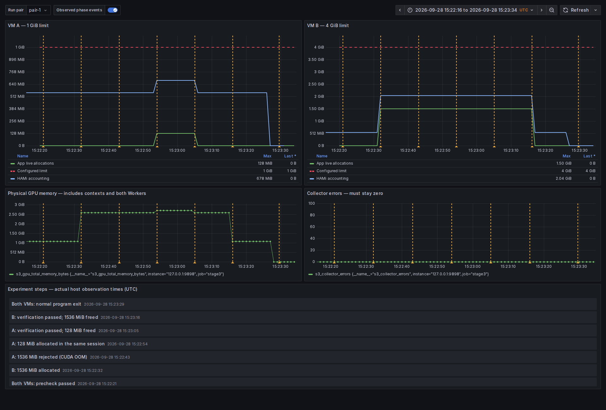

# 3단계 — 두 VM의 동일 GPU 공유와 서로 다른 메모리 한도

**2026-09-29 KST, 독립 VM 쌍 3/3 PASS.** 같은 물리 GPU를 사용하는 A(1 GiB 한도)와 B(4 GiB 한도)가 각각 1536 MiB를 요청했을 때 A는 CUDA OOM, B는 성공했다. A는 **같은 프로세스·세션에서 128 MiB를 다시 할당**하고 검산·해제했다. 그동안 B는 기존 1536 MiB 할당을 유지하며 검산을 계속했다. 두 VM 모두 정상 종료·회수를 확인했다.

**녹화 없이 실제 터미널 PNG 6장, Grafana PNG 6장**, 세 쌍의 원본 로그·CSV·실측 시계열·최종 출력 표본을 제공한다. 자체 결과 UI는 없다. 터미널은 실험 후 실제 bash/tmux/ttyd에서 원본을 조회한 화면, Grafana는 실행 중 수집한 Prometheus 데이터를 해당 pair·절대 UTC 구간으로 사후 조회한 화면이다. 명령은 자동화 도구가 실제 셸에 입력했다.

## 실제 결과

| 독립 실행 | A: 1536 MiB | B: 1536 MiB | A: 후속 128 MiB | 검산 완료 횟수 A / B | 불일치 A / B | 회수 |
|---|---|---|---|---:|---|---|
| pair-1 | OOM (2) | 성공 (0) | 성공·검산·해제 | 13 / 46 | 0 / 0 | 양쪽 Released |
| pair-2 | OOM (2) | 성공 (0) | 성공·검산·해제 | 13 / 46 | 0 / 0 | 양쪽 Released |
| pair-3 | OOM (2) | 성공 (0) | 성공·검산·해제 | 13 / 46 | 0 / 0 | 양쪽 Released |

총 **1,109개 요청·4,436개 endpoint trace**, **177회 표본 검산·92,798,976개 정수 비교(반복 합계)**를 확인했다. 검산 횟수는 2 MiB 사전 점검 1회를 포함하며, 서로 다른 데이터 전체 용량을 뜻하지 않는다. 최종 앞·뒤 표본 byte도 별도 Python 기준 계산과 모두 일치했다.

**중요한 검사 범위:** 매회 살아 있는 allocation의 **앞 1 MiB는 GPU add 19 커널 실행 후 전수 비교**, **뒤 1 MiB는 최초 입력이 유지되는지 전수 비교**했다. 1536 MiB 전체를 전수 검사한 결과는 아니다. 메모리 요청량은 실제 cudaMalloc 크기다.

## 발표에서 먼저 볼 화면

**① 동일한 요청량에 서로 다른 결과 — 왼쪽 A, 오른쪽 B**



`api_result=2`는 CUDA 메모리 할당 오류, `0`은 성공이다. 아래 Worker 원본 응답에서도 같은 결과를 확인한다. 통신 응답의 transport_status는 양쪽 모두 0이다.

**② A의 작은 재요청과 B의 지속 실행**



A의 OOM과 128 MiB 성공 뒤 수신한 **실제 B PROGRESS 레코드**를 오른쪽에 표시했다. 발췌 선정 규칙과 원본 연결은 [export_stage3.py](sources/export_stage3.py)에 있다.

**③ 메모리 변화 — 실제 Grafana**



초록은 앱의 성공한 현재 할당량, 빨간 점선은 설정 한도, 파랑은 HAMi 집계값이다. HAMi 값에는 앱 요청 외 사용량이 포함되므로 앱 할당량과 같다고 가정하지 않는다. 아래 장치 전체 사용량은 두 Worker·컨텍스트 등을 포함한 별도 지표다. A의 실패 요청은 앱의 성공 할당량에 더하지 않는다.

[발표 배치안](PRESENTATION_GUIDE.md)에서 화면별 설명과 발표 문장을 확인할 수 있다.

## 확보 화면 전체

| 순서 | 터미널 정적 캡처 (pair-1 대표) |
|---|---|
| 1 | [VM–Worker·동일 GPU·적용 한도](terminal-captures/01-binding.png) |
| 2 | [A의 준비 상태와 B의 1536 MiB 할당](terminal-captures/02-baseline-and-B-allocation.png) |
| 3 | [같은 요청량의 OOM / 성공 및 Worker 응답](terminal-captures/03-same-request-different-results.png) |
| 4 | [같은 A 세션의 128 MiB 성공과 B 진행](terminal-captures/04-A-recovery-B-continuation.png) |
| 5 | [양쪽 검산 결과·해제](terminal-captures/05-correctness-and-free.png) |
| 6 | [원본·출력 byte 재검증과 정상 회수](terminal-captures/06-offline-verification-and-cleanup.png) |

| 독립 실행 | 메모리·한도·사건 시점 | 검산 완료 카운터·OOM·오류 |
|---|---|---|
| pair-1 | [Grafana 메모리](grafana-captures/pair-1-memory.png) | [Grafana 진행](grafana-captures/pair-1-progress.png) |
| pair-2 | [Grafana 메모리](grafana-captures/pair-2-memory.png) | [Grafana 진행](grafana-captures/pair-2-progress.png) |
| pair-3 | [Grafana 메모리](grafana-captures/pair-3-memory.png) | [Grafana 진행](grafana-captures/pair-3-progress.png) |

PNG 옆의 텍스트에는 실제 화면 출력을 보존했다. [터미널 명령·종료 코드](terminal-captures/commands.json), [터미널 캡처 메타데이터](terminal-captures/metadata.json), [Grafana URL·시간 구간](grafana-captures/metadata.json)으로 추적한다. 역할 교환 실험은 실행하지 않았다.

## 조건과 절차

- 매회 새 VM 2개·Worker 2개·allocation 2개·session 2개. VM당 8 vCPU·16 GiB RAM, SHM 64 MiB·세션 1개.
- GPU 1 한 개: `GPU-7d708c42-8d4a-16d5-0746-474567157aa3`. 실제 두 Worker host PID를 같은 UUID의 GPU 프로세스 목록과 대조했다.
- A 한도 1024 MiB, B 한도 4096 MiB. 둘 다 compute 50. 이번 실험에서 50% 연산 제한은 평가하지 않았다.
- A Guest CPU 0–7 / Worker 16–19, B Guest CPU 8–15 / Worker 20–23. NUMA 메모리 강제 고정 없음.
- C/PTX 프로그램, PyTorch 미사용. 1024 blocks × 256 threads, uint32 add 19, 서로 다른 A/B seed. Guest·Worker trace ON.
- 별도 성능 warmup 없음. 시작 시 2 MiB 할당·검산·해제 사전 점검 1회. `cudaMemGetInfo`의 준비 여유량을 기록하고 B 1536 MiB / A 128 MiB를 수용할 수 있는지 확인했다.
- B 큰 할당 → A 큰 요청·OOM → A 작은 할당·검산 → A 해제 → B 최종 검산·해제 → 종료. 준비 완료 및 각 단계 뒤 10초 대기를 두었다. 실제 명령·관측 시각은 각 pair의 phases.json과 각 VM의 stdin-commands.jsonl에 있다.
- B는 약 1초 간격으로 동기화·검산을 완료하고 카운터를 올렸다. 이 간격과 완료 수는 **생존·정확성 확인용**이며 처리량 성능 비교가 아니다.

[protocol.json](protocol.json)에 기준 커밋·이미지·바이너리 해시, [build.json](build.json)에 probe 빌드 조건, [source-hashes.json](source-hashes.json)에 이번 소스 스냅샷을 보존했다. Guest library와 Worker 이미지는 2단계 버전을 재사용했다. 공통 실행 도구에 VM별 memory_mib 인자만 추가했으며 기본값은 4096이다. 기존 로컬 control_plane.py 수정과 제어기 재배포는 이번 변경에 포함하지 않았다.

## 원본 자료와 재검증

| 자료 | 위치 |
|---|---|
| 조건·호스트 실행 기록 | [protocol.json](protocol.json), [execution.txt](execution.txt) |
| 반복별 최종 판정 | [summary.csv](summary.csv), [summary.json](summary.json) |
| 요청·할당·해제 | [allocation-events.csv](allocation-events.csv): pair, VM, session, 요청량, 오류, 현재 할당량, Guest 시각·호스트 수신 시각 |
| 매회 검산 진행 | [progress.csv](progress.csv): 완료 수, 검사 원소 수, 불일치, 현재 할당량 |
| 1회차 원본 | [A 로그](pair-1/A/stdout.jsonl), [B 로그](pair-1/B/stdout.jsonl), [검증](pair-1/validation.json) |
| 2회차 원본 | [A 로그](pair-2/A/stdout.jsonl), [B 로그](pair-2/B/stdout.jsonl), [검증](pair-2/validation.json) |
| 3회차 원본 | [A 로그](pair-3/A/stdout.jsonl), [B 로그](pair-3/B/stdout.jsonl), [검증](pair-3/validation.json) |
| 수집·조회 원본 | [관측 JSONL 압축본](monitoring/observations.jsonl.gz), [Prometheus 조회 조건](monitoring/queries.json), [annotation](monitoring/annotations.json) |
| 계측 설정 | [Prometheus 설정](monitoring/prometheus.yml), [메모리 대시보드](monitoring/dashboards/stage3-memory.json), [진행 대시보드](monitoring/dashboards/stage3-progress.json) |
| 회수·보존 | [기존 VM 보존·GPU 프로세스 종료](final-audit.json), [두 backing PVC 빈 상태](backing-audit.json), [임시 도구 종료](tool-cleanup.json) |
| 검증·무결성 | [bundle-check.json](bundle-check.json), [SHA256SUMS](SHA256SUMS) |

각 `pair-N/A`, `pair-N/B`에는 guest-stderr.txt·worker-stderr.txt **원본 추적 로그**, command.json, process.json, host-receipts.jsonl, 적용 객체·배치·실제 라이브러리·회수 정보, 최종 head/tail 표본 `stage3-output-*.bin.gz`가 있다. guest_pointer는 Guest 가상 주소이고 Worker trace의 allocation_handle과 구분한다.

저장소 루트에서 GPU 없이 재검증할 수 있다.

```sh
python3 experiments/evidence/verify_stage3.py experiments/evidence/results/2026-09-29-stage3/pair-1
python3 experiments/evidence/verify_stage3.py experiments/evidence/results/2026-09-29-stage3/pair-2
python3 experiments/evidence/verify_stage3.py experiments/evidence/results/2026-09-29-stage3/pair-3
cd experiments/evidence/results/2026-09-29-stage3
sha256sum -c SHA256SUMS
```

검증기는 원본을 읽어 예상 OOM의 요청 크기·반환 코드, 동일 세션·프로세스, 네 지점 응답 대응, 실제 출력 byte, B의 기존 할당 유지·진행, 적용 한도와 정상 회수를 검사한다. OOM을 성공으로 변조한 복사본과 출력 byte를 변조한 복사본을 거절하는 검사도 통과했다. 상세 재현은 [REPRODUCE.md](REPRODUCE.md)를 따른다.

## 계측 의미와 한계

Prometheus 3.5.0 / Grafana 12.0.2를 사용했다. 수집 목표는 1초이며 실제 표본 간격·누락 여부는 [bundle-check.json](bundle-check.json)에 있다. 원본 관측 시각과 Prometheus 1초 query_range 결과를 함께 보존한다. 앱 지표는 실제 stdout에서 추출했고 HAMi 원본과 nvidia-smi 관측은 별도로 수집했다. 앱 로그 지표의 Grafana 표시는 독립적인 두 번째 정확성 검사가 아니다.

사건 annotation은 호스트에서 결과를 확인한 시각이다. B의 진행은 A 사건 전후의 호스트 로그 수신 구간에서 확인하며, Guest 간 시각 차이를 단방향 지연으로 해석하지 않는다. 그래프의 기울기·완료 횟수로 간섭이나 성능 우열을 판단하지 않는다.

이번 결과는 **동일 GPU 공유, VM별 메모리 한도, 예상 OOM 이후 같은 세션의 정상 실행** 범위다. 악성 커널 격리, 모든 장애의 격리, 한도 경계 정밀도, 두 세션 합산 제한, TCP 대비 오버헤드는 별도 실험이다.

첫 pair 준비 중 Worker 이미지 캐시 누락이 발생해 보관된 동일 OCI digest를 다시 import했다. GPU를 쓰지 않는 임시 이미지 유지 Pod를 사용한 후 삭제했다. [준비 이벤트](preparation-events.json), [이미지 import 출력](image-import.txt)에 기록했으며 CUDA 프로그램 실행 실패나 입력 변경은 없었다.
