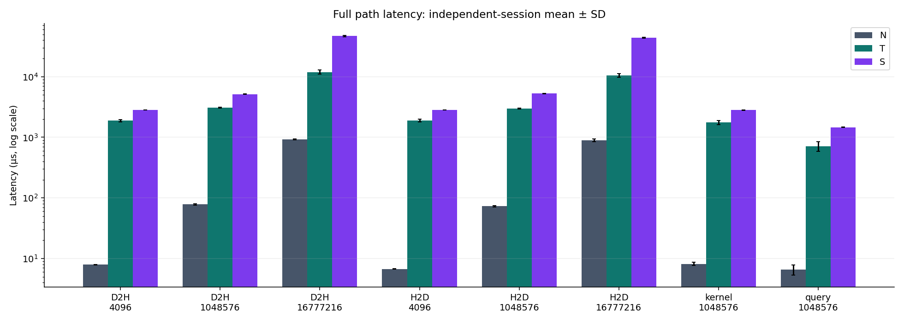
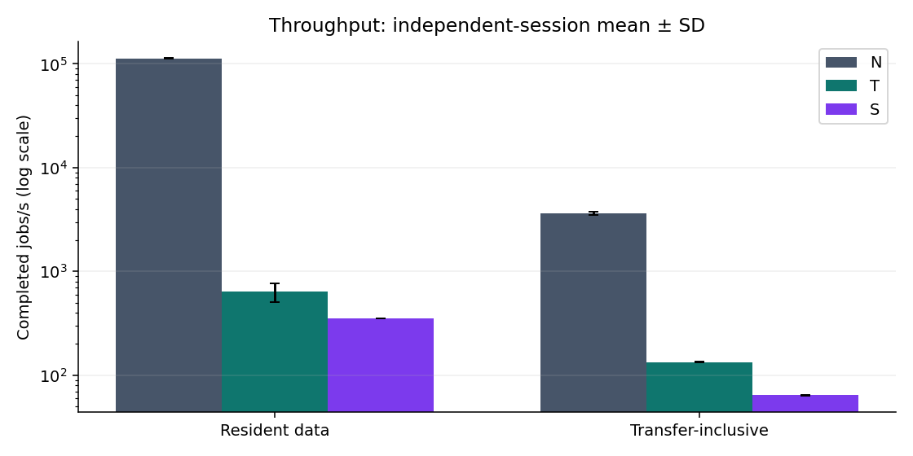
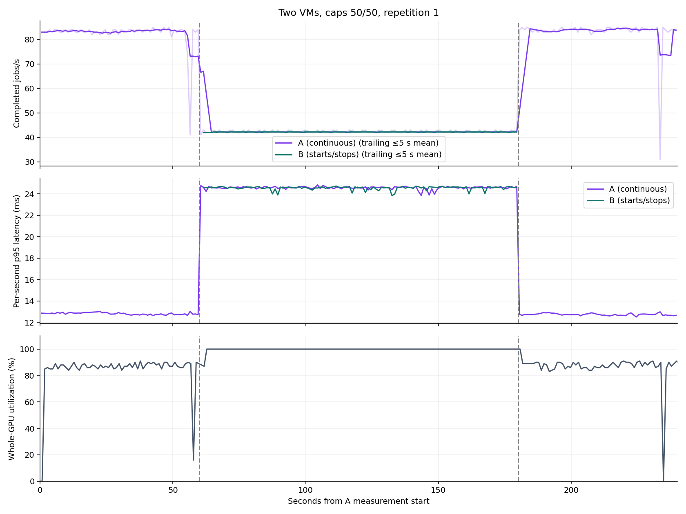
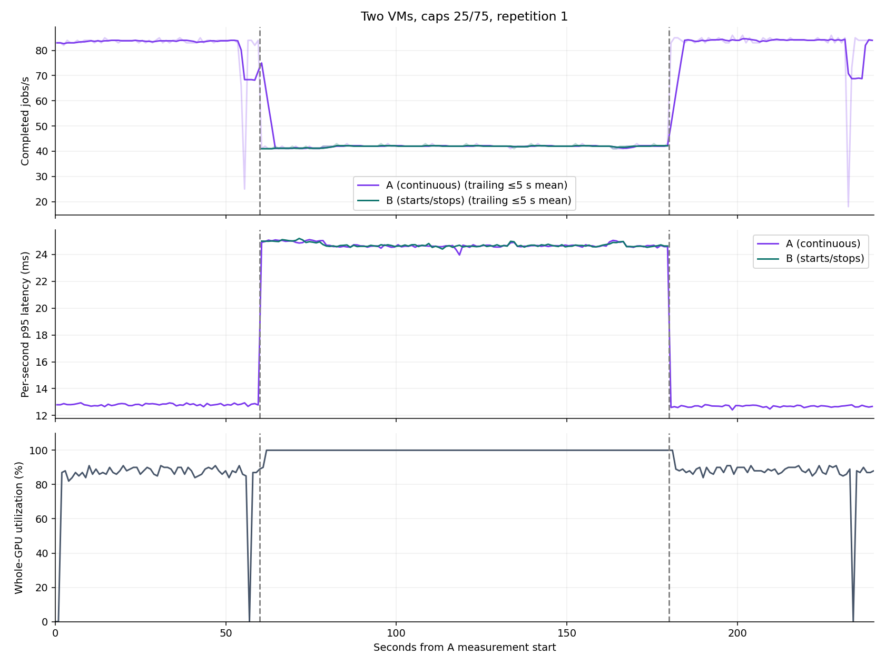

# VMWeave 성능 분석 — 2026-09-30 시작 campaign

원시 표본·검산 성공 기록·시각 연속성·정상 회수 검증: **PASS**. 전체 계획 완료: **True**.
**검산 성공과 HAMi 이용률 상한 준수는 별도 판정입니다.** 아래 상한 결과를 함께 확인해야 합니다.

측정 후 정리에서도 Foreground 삭제와 제어기 증거 확인 순서가 충돌했습니다. 채널 삭제 방식을 수정했고, 이미 Released였던 채널 한 개는 이전 커밋의 회수 기록과 현재 유휴·빈 자원 상태를 확인한 뒤 finalizer를 수동 해제했습니다. 이를 정상 자동 회수로 표시하지 않습니다. [정리 실패와 복구 증거](cleanup-recovery/README.md)를 함께 확인하세요.

전체 실행을 완료했지만, 기대한 상한 제어와 SHM 성능 우위를 확인한 결과는 아닙니다.
단일 VM의 상한 25·50·75는 15회 중 15회 사전 이용률 기준을 초과했습니다. N/T/S 호출·전송 지표 8개 중 8개에서 SHM의 평균 지연이 TCP/RPC보다 컸습니다. 공유 시 A의 처리량 유지율은 조건별 평균 49.4–50.1%였습니다. 세부 범위와 해석상의 한계는 아래에 기록합니다.
[최종 자원 감사](final-audit.json) · [모니터링 재조회](monitoring/README.md) · [원본 체크섬](SHA256SUMS)

공유 단계에서 1쌍의 실행기가 중단됐습니다. 해당 시도에는 측정 시작·완료 기록이 없어 원본을 보존하고 완료 반복에서 제외했습니다. 이미 완료한 7쌍을 유지한 채 별도 이름의 대체 실행과 나머지 조건을 재개했습니다. 원래 대기 로그와 재개 사이에 약 6시간의 공백이 있으며 시간대별 환경 차이를 완전히 배제하지 못합니다. 따라서 연속 무중단 실행을 뜻하지 않습니다. [중단 이력](interruptions.json)과 [재개 절차](RECOVERY.md)를 함께 확인하세요.

## 실험 구성

| 항목 | 조건 |
|---|---|
| GPU | NVIDIA RTX PRO 6000 Blackwell Server Edition, 물리 SM 188개, 동일 GPU UUID |
| 제어기 | 중앙 Go Operator, vmweave.io/v1alpha1 |
| VM | 8 vCPU, 16 GiB RAM |
| 호스트 CPU affinity | VM/launcher 슬롯 a: 0–7, b: 8–15; Worker a: 16–19, b: 20–23; N: 0–7; T server: 16–19. 논리 CPU 번호이며 CPU 독점 할당은 아님 |
| N | 호스트 직접 CUDA + HAMi |
| T | Flyt 기반 TCP/RPC + MPS, 전체 188 SM. 기존 호환성 패치 포함 |
| S | VMWeave SHM + HAMi |
| HAMi 설정 | FORCE, 메모리 4096 MiB, 이용률 상한 25/50/75/100 |
| 반복 | 조건별 독립 5회. 호출 수·1초 표본 수를 독립 반복으로 세지 않음 |
| 단일 VM | 준비 30초 → 120초 실행(중앙 90초 집계) → 고정 작업 2,500회 |
| 다중 VM | A 240초 실행, B는 +60~+180초 부하. B 프로세스/Worker/VM은 회복 관측 후까지 유지 |
| 비교 부하 | 동일 입력·정수 PTX 커널. T는 동일 PTX에서 생성한 cubin 사용 |

실제 집계: N/T/S 15 세션·105 측정 구간, 단일 VM 20 세션, 다중 VM 20 쌍.
[관측과 원인 분석의 경계](DIAGNOSTICS.md) · [고정 프로토콜](protocol.json) · [N/T/S 시작 시 프로토콜](protocol-overhead.json) · [계획 변경 이력](deviations.json) · [실행 코드](../../../performance/README.md)

## 단일 VM 이용률 상한

| 상한 | n | GPU 이용률 평균 (%) | 처리량 (작업/초, 평균 ± SD) | p95 지연 (ms, 실행별 값의 평균 ± SD) | 2,500회 완료 시간 (s, 평균 ± SD) | 상한 판정 |
|---:|---:|---:|---:|---:|---:|---|
| 25 | 5 | 84.39 | 80.61 ± 0.65 | 12.75 ± 0.01 | 31.23 ± 0.55 | FAIL 5 |
| 50 | 5 | 85.75 | 82.68 ± 0.38 | 12.75 ± 0.02 | 30.43 ± 0.42 | FAIL 5 |
| 75 | 5 | 87.22 | 83.24 ± 0.12 | 12.77 ± 0.02 | 30.06 ± 0.15 | FAIL 5 |
| 100 | 5 | 88.07 | 83.90 ± 0.13 | 12.76 ± 0.02 | 29.77 ± 0.08 | BASELINE 5 |

상한 판정은 중앙 구간 평균 이용률 ≤ 설정값 + 10 percentage points, 유효 계측 ≥95%, 정상 작업 완료를 기준으로 합니다. 이 허용오차는 연구용 사전 기준이며 HAMi의 공식 보장값이 아닙니다. 100은 연산 제한 없는 기준(BASELINE)이고, 상한은 처리량 비율이나 코어 독점 할당을 뜻하지 않습니다.

[30초 구간별 처리량·지연·이용률](analysis/single-timecourse.csv)도 보존합니다. 평균 상한 위반을 제어 경로의 영구 비활성으로 단정하지 않으며, 판정 범위는 명시한 워밍업과 관측 구간입니다.

## N / Flyt TCP·RPC / VMWeave SHM 비교

클라이언트 측 완료 시간을 측정합니다. query는 cudaMemGetInfo, kernel은 launch+sync, H2D/D2H는 각 copy+sync입니다. 표의 크기는 작업 버퍼 크기이며 query 요청의 네트워크 전송량을 뜻하지 않습니다. resident는 GPU 상주 데이터로 kernel+sync를 반복하고, transfer는 매 작업에 H2D와 D2H를 포함합니다. 두 처리량 시험의 커널 내부 반복은 64회이고, 상한·공유 시험은 1,048,576회이므로 두 절의 작업/초를 직접 비교하지 않습니다.

| 지표 | 크기 (bytes) | N (µs, 평균 ± SD) | T (µs, 평균 ± SD) | S (µs, 평균 ± SD) | S/T 평균 지연 비 |
|---|---:|---:|---:|---:|---:|
| D2H | 4,096 | 7.89 ± 0.07 | 1,881.40 ± 89.08 | 2,833.73 ± 17.83 | 1.51 |
| D2H | 1,048,576 | 78.43 ± 2.21 | 3,090.13 ± 58.36 | 5,169.57 ± 36.53 | 1.67 |
| D2H | 16,777,216 | 925.86 ± 20.68 | 11,923.68 ± 936.77 | 46,973.84 ± 1,268.72 | 3.94 |
| H2D | 4,096 | 6.69 ± 0.06 | 1,890.81 ± 100.22 | 2,827.81 ± 16.61 | 1.50 |
| H2D | 1,048,576 | 72.73 ± 2.18 | 2,990.97 ± 65.11 | 5,272.18 ± 31.67 | 1.76 |
| H2D | 16,777,216 | 890.66 ± 48.38 | 10,525.22 ± 763.54 | 43,955.63 ± 462.43 | 4.18 |
| kernel | 1,048,576 | 8.12 ± 0.50 | 1,769.03 ± 139.93 | 2,825.06 ± 20.76 | 1.60 |
| query | 1,048,576 | 6.59 ± 1.29 | 716.73 ± 129.63 | 1,467.05 ± 13.59 | 2.05 |

| 처리량 지표 | N (작업/초, 평균 ± SD) | T (작업/초, 평균 ± SD) | S (작업/초, 평균 ± SD) |
|---|---:|---:|---:|
| resident | 113,190.43 ± 244.63 | 637.80 ± 130.84 | 355.19 ± 0.60 |
| transfer | 3,638.83 ± 130.81 | 133.54 ± 1.42 | 64.15 ± 0.32 |

N도 HAMi를 포함합니다. T의 MPS와 N/S의 HAMi, 큐·동기화·실행기 차이가 포함되므로 결과는 전체 구현 경로의 비교입니다. PTX와 cubin의 계산·입력은 같지만 동일 기계어를 보장하지 않습니다. 전송 매체만의 효과나 모든 CUDA/AI 작업에 일반화하지 않습니다.

## 다른 VM 부하의 시작·종료

| A/B 상한, A CPU 슬롯 | n | A 단독 처리량 | 동시 실행 시 A 처리량 | 종료 후 A 처리량 | 유지율 | A 단독 p95 (ms) | 동시 실행 시 A p95 (ms) |
|---|---:|---:|---:|---:|---:|---:|---:|
| 50/50/a | 5 | 83.53 ± 0.19 | 41.88 ± 0.49 | 84.01 ± 0.11 | 50.14 ± 0.55% | 12.83 ± 0.04 | 24.73 ± 0.16 |
| 50/50/b | 5 | 83.65 ± 0.31 | 41.53 ± 0.62 | 83.88 ± 0.18 | 49.64 ± 0.60% | 12.82 ± 0.05 | 24.99 ± 0.40 |
| 25/75/a | 5 | 83.81 ± 0.11 | 41.49 ± 0.48 | 83.09 ± 2.12 | 49.51 ± 0.61% | 12.80 ± 0.03 | 24.95 ± 0.38 |
| 75/25/b | 5 | 83.75 ± 0.22 | 41.41 ± 0.30 | 83.87 ± 0.25 | 49.44 ± 0.31% | 12.80 ± 0.04 | 24.84 ± 0.05 |

| A/B 상한, A CPU 슬롯 | B 동시 처리량 (작업/초, 평균 ± SD) | B 동시 p95 (ms, 평균 ± SD) | A+B 동시 처리량 (작업/초, 평균 ± SD) |
|---|---:|---:|---:|
| 50/50/a | 41.88 ± 0.49 | 24.84 ± 0.41 | 83.76 ± 0.97 |
| 50/50/b | 41.52 ± 0.61 | 25.08 ± 0.52 | 83.05 ± 1.23 |
| 25/75/a | 41.50 ± 0.48 | 24.95 ± 0.39 | 82.99 ± 0.96 |
| 75/25/b | 41.41 ± 0.30 | 24.86 ± 0.07 | 82.81 ± 0.60 |

| A/B 상한, A CPU 슬롯 | VM A/B 이용률 평균 (%) | A/B 상한 초과 횟수 | 회복 확인 | 회복 확인 시간 (s, 평균 ± SD) |
|---|---:|---:|---:|---:|
| 50/50/a | 48.24 / 50.50 | 0 / 0 | 5/5 | 5.99 ± 0.01 |
| 50/50/b | 48.63 / 49.90 | 0 / 0 | 5/5 | 5.99 ± 0.01 |
| 25/75/a | 50.77 / 47.62 | 5 / 0 | 5/5 | 5.98 ± 0.00 |
| 75/25/b | 50.21 / 47.92 | 0 / 5 | 5/5 | 5.99 ± 0.01 |

시각 정렬에는 VM별 SSH 시각 대조 5회 중 최소 왕복시간의 중간값 추정을 사용했습니다. 두 VM의 반왕복시간을 합한 정렬 불확실성 한계는 실행별로 보존하며, 이번 실행의 최댓값은 0.429초입니다. 회복 시간의 소수점 표기는 그 수준의 물리적 동기 정확도를 보장하지 않습니다. 시작 시각 검증의 250 ms 허용오차는 보정한 시각끼리의 비교 기준입니다. 개별 작업 지연·실행 지속시간은 각 VM의 단조 시계로 측정합니다.

각 값은 독립 실행 5회의 평균 ± SD입니다. A는 계속 부하를 실행하는 VM입니다. 역할 교환 실행에서 A의 실제 VM/CPU 슬롯과 상한을 교환합니다. 같은 상한의 단독 구간과 비교하므로 상한 자체의 효과와 공유에 따른 추가 간섭을 구분할 수 있습니다. 25/75를 처리량 1:3 보장으로 해석하지 않습니다.

시작 직후 10초의 처리량·p95, 종료 직후 10초의 p95, 회복 시간, Worker Pod에 대응시킨 HAMi 이용률·상한 판정과 PID별 pmon 교차 계측은 [실행별 표](analysis/shared.csv)에 보존합니다. 회복은 기존 단독 처리량의 ±10% 범위에 1초 구간 5개가 연속 들어오는 조건으로 확인합니다. 회복 시간은 다섯 번째 구간의 종료 시점에서 B의 실제 부하 종료 시점을 뺀 값이며, 연속 구간 최초 진입 시간도 별도로 기록합니다. 빈 회복 값은 관측 종료 전 기준을 충족하지 못했다는 뜻입니다.

경쟁만으로 이용률이 낮아질 수 있으므로, 공유 상태에서 상한 이하라는 사실만으로 제한 정책 성공을 주장하지 않습니다. 장치 전체 DCGM 값과 VM별 프로세스 이용률을 구분합니다.

그래프의 옅은 선은 완전한 1초 구간의 완료율, 진한 선은 과거 최대 5개 구간의 이동평균입니다. 시작·종료의 불완전한 구간을 1초 처리량으로 계산하거나 0으로 채우지 않았습니다. 회복 판정은 평활화 전 1초 완료율을 사용합니다.

## 모니터링·실행 증거

Prometheus 3.5.0, Grafana 12.0.2, DCGM Exporter, HAMi 모니터링, node-exporter를 사용했습니다. GPU·애플리케이션 지표는 1초 수집을 목표로 구성했고, Pod CPU는 중복되지 않는 상위 cgroup 카운터로 수집했습니다. 공유 구간의 VM별 이용률은 Worker Pod와 GPU UUID에 대응시킨 HAMi 지표를 사용하고, 실제 nvidia-smi pmon 원문을 PID와 측정 시간으로 대응시켜 교차 확인합니다. pmon은 요청한 1초보다 실제 간격이 길 수 있으므로 HAMi의 1초 표본 기준과 혼용하지 않습니다. 센서의 내부 갱신 주기와 표본의 독립성은 별개입니다. 원시 표본은 메모리에 모아 측정 후 저장하며, 실제 진행 카운터는 측정 중 1초마다 출력합니다. 따라서 처리량에는 이 계측 비용이 포함됩니다. 짧은 전송 시험의 p99는 표본 수와 함께 참고해야 하며, 전체 지연 표본을 독립 실험 반복으로 세지 않습니다.

- [실행별 원본·설정·회수 증거](runs/)와 [실행별 통계](analysis/).
- [실제 Grafana 캡처](captures/): 사전 지정한 첫 반복을 절대 UTC 범위로 조회한 측정 후 화면입니다.
- [검증 결과](validation.json): 원시 표본 건수·출력 검산·시각 연속성·Released 확인.
- [모니터링 자료](monitoring/)와 [터미널 세션](terminal/): 자동 실행 사실을 표시하고 실제 명령·결과를 보존합니다.
- [소스·바이너리 조건](protocol.json): GPU UUID, 이미지 digest, 실제 프로그램 SHA-256을 기록합니다.

N/T/S 마이크로벤치마크의 개별 지연은 원시 CSV로 보존하며 Grafana의 last-operation-latency 패널은 단일·공유 부하 시험에서만 채워집니다. 해당 패널의 N/T/S No data를 작업 지연 0으로 해석하지 않습니다. 일반 GPU 이용률과 SM activity는 같은 지표가 아닙니다. HAMi의 상한 100 이용률 계측이 0으로 남는 경우에는 idle로 해석하지 않고 DCGM과 프로세스 계측을 사용합니다. 조회 결과가 없거나 지원하지 않는 지표도 0으로 대체하지 않습니다.

예비 실행의 준비 오류·이미지 GC 복구·부하 선택·시계 보정은 별도 이력에 남겼으며 본 실험 반복에 합산하지 않았습니다. SSH 비밀키와 인증 비밀값은 공개 증거에서 제외 또는 마스킹했습니다. 전체 계획 완료 여부와 자원 정리 상태는 검증 결과 및 최종 감사 파일을 기준으로 확인합니다.
