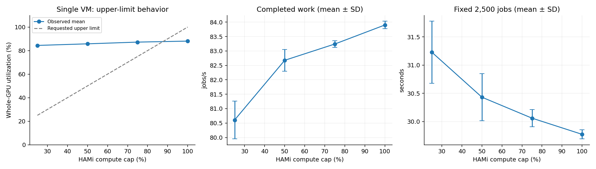

# 단일 VM 이용률 상한 — 완료한 두 번째 단계

단일 VM의 상한 25/50/75/100을 각각 새로운 VM·Worker 할당으로 5회 측정했습니다. 본 문서는 단일 VM 단계의 고정 결과입니다. 다중 VM 실험은 후속 단계입니다.

| 이용률 상한 | 평균 GPU 이용률 (%) | 처리량 (작업/초, 평균 ± SD) | 2,500회 완료 시간 (s, 평균 ± SD) | 상한 판정 |
|---:|---:|---:|---:|---|
| 25 | 84.39 | 80.61 ± 0.65 | 31.23 ± 0.55 | FAIL 5/5 |
| 50 | 85.75 | 82.68 ± 0.38 | 30.43 ± 0.42 | FAIL 5/5 |
| 75 | 87.22 | 83.24 ± 0.12 | 30.06 ± 0.15 | FAIL 5/5 |
| 100 | 88.07 | 83.90 ± 0.13 | 29.77 ± 0.08 | 기준(BASELINE) |

30초 워밍업 후 120초 실행 중 중앙 90초를 집계했습니다. 상한 판정 기준은 평균 이용률 ≤ 설정값 + 10%p, 유효 계측 ≥95%입니다. 이 허용오차는 실험 기준이며 HAMi의 공식 보장값이 아닙니다. 100은 연산 제한 없는 기준이고 별도 제한 비활성 조건은 추가하지 않았습니다.

**실행 검증 20/20 PASS와 상한 준수 실패를 구분합니다.** 상한 25·50·75에서 모두 기준을 넘었으며, 처리량도 설정값에 비례하지 않았습니다. 이용률 상한은 원래 처리량 비율을 보장하지 않으므로 처리량 비례 여부 자체를 실패 기준으로 사용하지 않았습니다.

FORCE 정책·실제 SM_LIMIT·HAMi 라이브러리 매핑과 cuLaunchKernel 호출 대상은 실행 중 기록했습니다. 평균 위반을 제어기의 영구 비활성으로 단정하지 않습니다. 주기적인 지연과 이용률 하락도 원본에 보존되어 있습니다. 이 결과는 해당 GPU·설치된 HAMi 빌드·부하·관측 시간에 한정합니다.

[실행별 전체 통계](analysis/single.csv) · [30초 구간별 통계](analysis/single-timecourse.csv) · [단계 검증](single-validation.json) · [원인 분석의 범위](DIAGNOSTICS.md) · [실제 Grafana 화면](captures/perf-c-r1-25-grafana.png) · [계획과 실행 코드](../../../performance/README.md)
