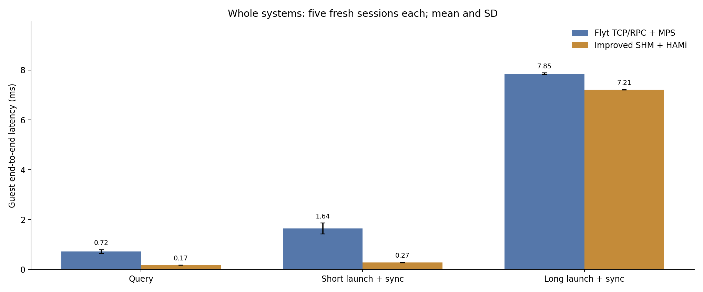
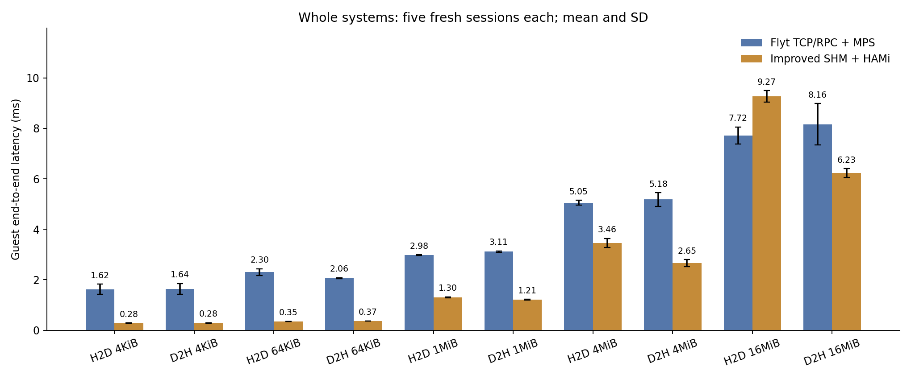
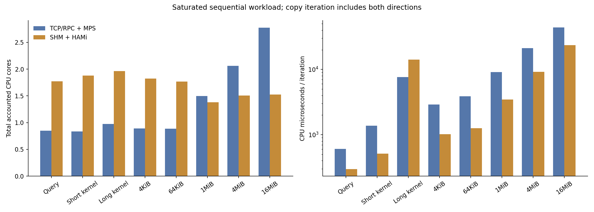

# Flyt TCP/RPC와 개선 SHM: 전체 시스템 비교 결과

기존 Flyt TCP/RPC+MPS와 개선 VMWeave SHM+HAMi를 같은 기간에 새로 측정했다.
시스템별 독립 5회, 10개 새 VM 세션, 80개 측정 구간이다. 각 구간은 최소 10초·50회 워밍업 후 60초를 측정했다.
과거 TCP 결과나 예비 실행을 본 통계에 재사용하지 않았다.

13개 지연 지표 중 12개에서 SHM의 실행별 평균을 평균한 값이 더 작았다.
이는 시스템 구성 전체의 비교이며, 차이 전부를 TCP/RPC와 SHM 전송 매체만의 효과로 귀속하지 않는다.
MPS/HAMi, 요청 처리기, 버퍼 관리와 모듈 로딩 경로의 차이도 포함한다.

## 지연

평균 ± SD는 독립 실행 5개의 평균과 표준편차이다. 요청 표본을 독립 반복으로 세지 않았다.
`query-1048576`의 숫자는 probe 준비 버퍼 크기이며 query 요청 payload가 1MiB라는 뜻은 아니다.
전송은 H2D/D2H를 교대로 수행하며 방향별 시간은 복사와 명시적 완료 동기화를 포함한다.
양수 감소율은 SHM이 빠름을, 음수는 느림을 뜻한다.

| 항목 | TCP/RPC 평균 ± SD (ms) | SHM 평균 ± SD (ms) | SHM 지연 감소율 |
|---|---:|---:|---:|
| CUDA query | 0.7184 ± 0.0765 | 0.1676 ± 0.0064 | +76.7% |
| 짧은 커널 + 동기화 | 1.6430 ± 0.2168 | 0.2736 ± 0.0070 | +83.3% |
| 긴 커널 + 동기화 | 7.8504 ± 0.0363 | 7.2089 ± 0.0060 | +8.2% |
| H2D 4KiB + 동기화 | 1.6247 ± 0.1988 | 0.2778 ± 0.0104 | +82.9% |
| D2H 4KiB + 동기화 | 1.6383 ± 0.2161 | 0.2831 ± 0.0110 | +82.7% |
| H2D 64KiB + 동기화 | 2.3036 ± 0.1319 | 0.3468 ± 0.0025 | +84.9% |
| D2H 64KiB + 동기화 | 2.0592 ± 0.0251 | 0.3663 ± 0.0027 | +82.2% |
| H2D 1MiB + 동기화 | 2.9787 ± 0.0176 | 1.3026 ± 0.0177 | +56.3% |
| D2H 1MiB + 동기화 | 3.1121 ± 0.0289 | 1.2069 ± 0.0218 | +61.2% |
| H2D 4MiB + 동기화 | 5.0548 ± 0.0895 | 3.4608 ± 0.1737 | +31.5% |
| D2H 4MiB + 동기화 | 5.1817 ± 0.2714 | 2.6547 ± 0.1417 | +48.8% |
| H2D 16MiB + 동기화 | 7.7163 ± 0.3397 | 9.2713 ± 0.2256 | -20.2% |
| D2H 16MiB + 동기화 | 8.1599 ± 0.8242 | 6.2305 ± 0.1693 | +23.6% |

## 처리량

독립 실행별 완료율을 평균했다. 복사 한 작업은 H2D와 D2H를 각각 한 번 수행하는 왕복 반복이다.
방향별 유효 MiB/s는 원시 집계의 `effective_mib_s`에 있으며 동기화를 포함한 대역폭이다.

| 작업 | TCP/RPC 완료/초 | SHM 완료/초 | SHM/TCP 배율 |
|---|---:|---:|---:|
| CUDA query | 1403.80 | 5955.25 | 4.242× |
| 짧은 커널 + 동기화 | 617.50 | 3654.65 | 5.918× |
| 긴 커널 + 동기화 | 127.36 | 138.69 | 1.089× |
| 복사 왕복 4KiB | 310.26 | 1784.25 | 5.751× |
| 복사 왕복 64KiB | 229.37 | 1401.43 | 6.110× |
| 복사 왕복 1024KiB | 164.14 | 398.32 | 2.427× |
| 복사 왕복 4096KiB | 97.76 | 163.83 | 1.676× |
| 복사 왕복 16384KiB | 63.23 | 64.54 | 1.021× |

## Tail 지연

아래 p95는 각 실행의 p95를 평균한 값이다. p50과 p99는 원시 집계에 보존하며,
p99는 실행당 10,000개 미만이면 생략한다. 모든 크기에서 p99 비교가 가능하다고 주장하지 않는다.

| 항목 | TCP/RPC p95 (ms) | SHM p95 (ms) |
|---|---:|---:|
| CUDA query | 1.1415 | 0.2509 |
| 짧은 커널 + 동기화 | 2.3152 | 0.3999 |
| 긴 커널 + 동기화 | 8.1421 | 7.2965 |
| H2D 4KiB + 동기화 | 2.3361 | 0.4021 |
| D2H 4KiB + 동기화 | 2.3566 | 0.4035 |
| H2D 64KiB + 동기화 | 2.9058 | 0.5235 |
| D2H 64KiB + 동기화 | 2.5049 | 0.5132 |
| H2D 1MiB + 동기화 | 3.3632 | 1.5860 |
| D2H 1MiB + 동기화 | 3.5150 | 1.4888 |
| H2D 4MiB + 동기화 | 5.4999 | 3.9115 |
| D2H 4MiB + 동기화 | 5.7221 | 3.0529 |
| H2D 16MiB + 동기화 | 10.7009 | 9.9280 |
| D2H 16MiB + 동기화 | 12.5688 | 6.8174 |

## CPU 비용과 해석

포화 상태의 순차 요청 부하이므로 시스템별 완료 작업 수가 다르다. 초당 CPU 소비와 작업당 CPU 시간을 함께 제시한다.
T는 launcher(QEMU/Guest와 Guest client manager), cell(RPC/MPS/node manager), 전용 cluster manager/Mongo를 합산한다.
S는 launcher와 Worker를 합산한다. 서로 겹치지 않는 Pod cgroup 카운터이며 공통 Kubernetes·모니터링 인프라는 제외한다.
복사 한 반복은 두 방향의 전송·동기화를 포함한다. 고정 요청률에서의 비용 검증은 이번 범위가 아니다.

| 구간 | TCP/RPC CPU 코어 상당 | SHM CPU 코어 상당 | TCP/RPC CPU µs/반복 | SHM CPU µs/반복 |
|---|---:|---:|---:|---:|
| query-1048576 | 0.847 ± 0.029 | 1.773 ± 0.023 | 607.7 ± 45.6 | 298.0 ± 7.6 |
| kernel-1048576 | 0.837 ± 0.026 | 1.880 ± 0.004 | 1371.7 ± 142.3 | 514.8 ± 12.4 |
| longkernel-1048576 | 0.974 ± 0.004 | 1.964 ± 0.005 | 7647.8 ± 34.6 | 14162.9 ± 29.6 |
| copy-4096 | 0.889 ± 0.037 | 1.824 ± 0.008 | 2890.6 ± 250.3 | 1023.1 ± 35.0 |
| copy-65536 | 0.888 ± 0.006 | 1.765 ± 0.019 | 3875.0 ± 137.9 | 1259.8 ± 19.4 |
| copy-1048576 | 1.499 ± 0.010 | 1.383 ± 0.009 | 9130.6 ± 57.5 | 3472.1 ± 63.2 |
| copy-4194304 | 2.063 ± 0.022 | 1.508 ± 0.019 | 21113.0 ± 515.7 | 9218.8 ± 390.8 |
| copy-16777216 | 2.773 ± 0.072 | 1.526 ± 0.005 | 43984.2 ± 2452.5 | 23653.1 ± 652.2 |

SHM의 작업당 CPU 비용이 더 큰 구간: longkernel-1048576.

따라서 지연 감소만으로 CPU 효율 향상을 일반화하지 않는다. 구간별 비용과 지연의 교환 관계를 함께 판단해야 한다.

긴 커널의 CPU 구성을 아래처럼 분리했다. cgroup 관측은 소비 위치를 보여주며,
특정 함수나 전송 방식만을 원인으로 입증하는 프로파일링 결과는 아니다.

| 긴 커널 CPU 구성 | 코어 상당 |
|---|---:|
| T launcher | 0.164 |
| T cell | 0.799 |
| T manager | 0.012 |
| S launcher | 1.022 |
| S worker | 0.942 |

## GPU 장치 관측

대표적인 GPU 연산 부하인 긴 커널 구간의 DCGM 관측을 정리했다. 값은 구간 평균의 5회 평균 ± SD이다.
측정 GPU UUID를 기준으로 선택했으며 초기화·워밍업은 제외했다. 장치 전체 수치이므로
VM별 이용률이나 HAMi 상한 준수를 입증하지 않는다. 나머지 구간은 `gpu-summary.json`에 있다.

| 긴 커널의 장치 관측 | TCP/RPC | SHM |
|---|---:|---:|
| GPU 이용률 (%) | 87.83 ± 0.40 | 95.52 ± 0.11 |
| GPU 메모리 사용 (MiB) | 1166.00 ± 0.00 | 560.00 ± 0.00 |
| 전력 (W) | 266.56 ± 1.86 | 282.83 ± 0.48 |
| SM 클록 (MHz) | 2416.80 ± 7.47 | 2422.00 ± 0.00 |
| 온도 (°C) | 50.04 ± 1.04 | 51.83 ± 0.35 |

## 구간 내 변화

각 60초 구간의 최초·마지막 약 15초에서 실제 progress tick의 완료 수와 경과 시간으로 완료율을 계산했다.
아래는 시스템별 40개 구간에서 관측한 비율 범위이다. 1 미만이면 후반 완료율이 낮다.
기술 통계이며 안정성을 판정하기 위한 사전 임계값은 아니다. 변화의 원인은 이번 자료만으로 확정하지 않는다.
불리한 구간을 제거하거나 안정된 부분만 선택하지 않았으며, 본 통계에는 전체 60초를 유지했다.

| 시스템 | 후반/초반 완료율 비율 최솟값 | 최댓값 |
|---|---:|---:|
| T | 0.475 | 1.348 |
| S | 0.874 | 1.112 |

## 고정 조건·검증 범위

- GPU: NVIDIA RTX PRO 6000 Blackwell Server Edition, 드라이버 580.173.02. 실제 UUID와 188 SM을 드라이버로 확인했다.
- Guest: 동일 OS 이미지, 8 vCPU·16GiB. QEMU/Guest CPU 0–7, Worker/TCP cell 16–19, 전용 T manager 20–23.
- T: 기존 MPS 전체 SM 설정. S: 기존 개선 기본값, HAMi FORCE 100. GPU 메모리 요청은 모두 4096MiB.
- SHM 내부 계측·상세 요청 추적은 비활성화했다. 공통 Prometheus·DCGM 수집은 동일하게 적용했다.
- 같은 probe 소스와 입력·호출 순서·동기화 경계. S는 PTX, T는 기존 ELF parser에 필요한 정규화 cubin을 사용했다.
  동일 PTX 원본이지만 같은 GPU 기계어라고 가정하지 않는다. 빌드·파일 해시와 정규화 이력을 보존했다.
- T/S 실행은 겹치지 않는다. 순서를 반복별로 교대하고, workload 순서는 쌍 안에서 동일하게 고정했다.
- 모든 구간의 CUDA 반환값과 종료 시 전체 출력 버퍼를 검사했다. 모든 반복의 전체 버퍼를 매번 검산한 것은 아니다.
- Guest monotonic clock을 사용하며, CPU 시계열의 Guest/Host offset·불확실성은 각 실행에 기록했다.
- HAMi 이용률 상한 준수, 다중 VM, 학습·추론 애플리케이션, 유휴·버스트·고정 요청률은 이번 결과로 검증하지 않았다.
- 이번 변경은 실험 실행기·자료·문서이다. 비교 결과에 맞추어 측정 중 런타임 코드를 수정하지 않았다.

## 준비 실패와 복구

로컬 이미지 GC로 사라진 이미지를 같은 digest로 복구하고 stopped image-reference container로 참조를 유지했다.
Mongo 이미지 다운로드는 보조 Pod DNS 경로에서 실패하여 호스트 네트워크 경로로 수행했다. 글로벌 DNS/kubelet 설정은 변경하지 않았다.
첫 예비 시도는 기존 affinity helper가 manager 프로세스를 대상으로 하지 않아 workload 실행 전에 중단됐다.
UID로 제한한 manager helper를 추가하고 새 이름으로 예비 검증했다. 실패 시도는 별도로 보존했다.
본 실험의 중단·실패 여부는 [검증 결과](validation.json)와 개별 실행 원본을 확인한다.

## 자료

- [확정 프로토콜](protocol.json), [예비 검토](pilot-review.json), [전체 실행 검증](validation.json)
- [실행별 지연·처리량·유효 대역폭](summary.json), [CPU 원시 집계](cpu-summary.json), [GPU 계측 집계](gpu-summary.json), [원시 CSV와 환경](runs/)
- [구간 내 처리량 변화](stability.json): 최초·마지막 약 15초의 완료율을 비교한 기술 통계이며, 모든 60초 표본을 본 집계에 유지했다.
- [실제 명령·출력](commands.jsonl), [실제 실행 터미널](terminal/), [빌드·해시](build/)
- [Grafana 캡처](captures/), [실제 터미널 조회 캡처](terminal-captures/), [모니터링](monitoring/)
- [최종 자원 정리](cleanup-complete.json), [최종 감사](final-audit.json), [기존 자료 무변경 확인](prior-evidence-integrity.json)
- [실험 코드와 재현 절차](../../../system-comparison/README.md), [체크섬](SHA256SUMS)
