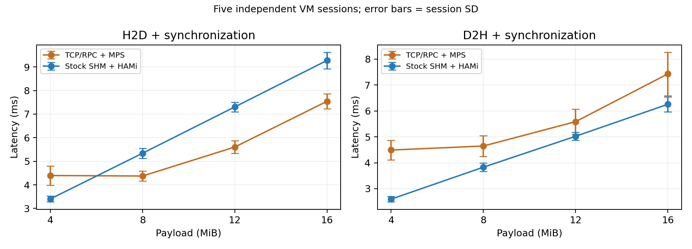
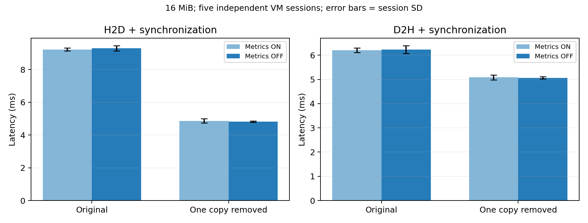
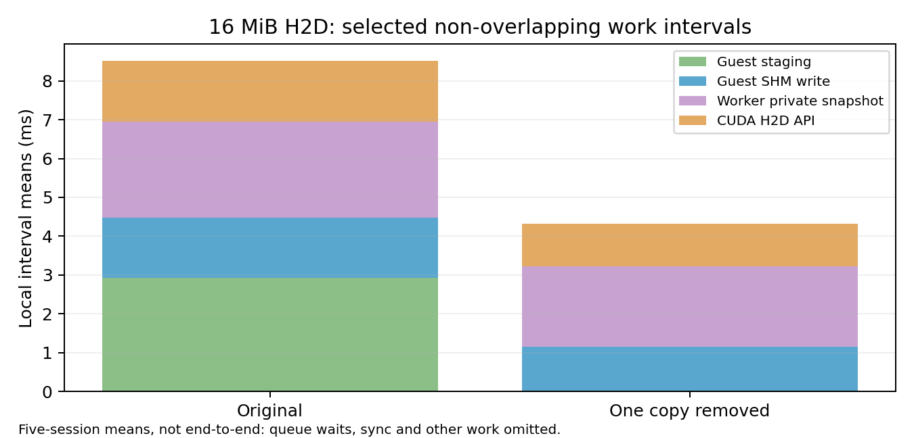
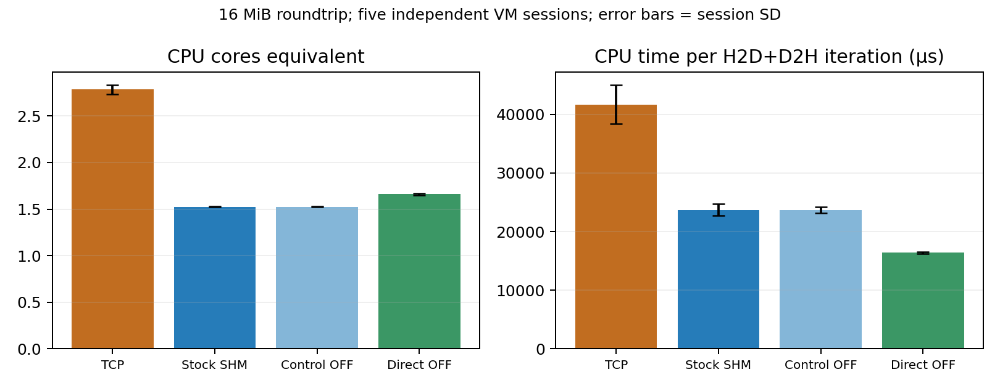

# CPU→GPU 16MiB 전송: SHM 지연 원인 분석 결과

2026-10-05 실험. **기존 SHM의 H2D 열세가 재현됐고, Guest 중간 payload 복사 제거의 개선 효과를 확인했다.** 기존 TCP/RPC는 7.5414 ± 0.3173ms, SHM은 9.2755 ± 0.3465ms로 SHM이 23.0% 느렸다. 같은 진단 바이너리에서 계측을 끈 SHM 대조군 9.2964 ± 0.1612ms가 복사 제거 후 4.8202 ± 0.0448ms로 바뀌었다(48.1% 감소).

운영 런타임 기본값은 변경하지 않았다. 후보는 분리된 실험 소스·이미지에서만 실행했다. TCP+MPS와 SHM+HAMi는 서로 다른 전체 시스템이며, 기존 20.2% 차이 전부를 특정 복사 한 구간의 비용으로 귀속하지 않는다.

## 목적과 판정 범위

1. 이전 20.2% 열세가 반복되는지 확인한다. 과거 원본을 재분석하고 새 VM으로 크기별 T/S 비교를 한다.
2. H2D 호출과 명시적 동기화를 분리하고, SHM 내부 복사·snapshot·CUDA API 시간을 측정한다.
3. 한 복사를 제거한 대조 실험으로 개선 가능한 원인을 검증한다. 계측 OFF와 작은 전송·H2D 단독 부하로 결과의 범위를 확인한다.
4. CPU 비용, 데이터 정확성, 정상 종료와 자원 반환을 함께 검증한다.

## 환경·코드·측정 방법

- 호스트는 Intel Xeon Gold 6530, 2소켓·4 NUMA 도메인, Linux 6.8.0-138-generic이다. NVIDIA driver 580.173.02, 빌드 CUDA Toolkit 12.8.93·GNU C 11.4.0을 사용했다. nvidia-smi의 CUDA 13.0 표시는 driver 호환 버전으로 빌드 Toolkit 버전과 구분한다. [환경 요약](environment-summary.json).
- GPU-4의 RTX PRO 6000 Blackwell Server GPU 한 개(UUID `GPU-7d708c42-8d4a-16d5-0746-474567157aa3`)를 캠페인 내에서 단독 사용했다. T는 MPS 188 SM, S는 HAMi FORCE 100, 요청 GPU 메모리 4096MiB다. 100 이외의 연산 상한 준수 시험은 아니다.
- Guest/QEMU는 호스트 CPU 0–7, Worker/TCP cell은 16–19, TCP manager는 20–23에 배치했다. GPU와 Guest CPU는 NUMA 0, 기본 Worker CPU는 NUMA 1이다. 메모리 노드를 강제로 binding하지 않았으며 실행 중 `numa_maps`를 보존했다. Worker 8–11 비교는 아래의 별도 탐색 실험이다.
- 운영 소스 기준은 `00cf878`이다. 진단 코드의 실제 내용은 [최종 portable patch](build/final-portable.patch), 바이너리 SHA256은 [최종 빌드](build/final-runtime-hashes.json), 경로별 실행 이미지·라이브러리·CPU 배치는 각 `runs/*/` 기록에 있다. 수정된 진단 코드를 기준 커밋에 이미 포함된 코드라고 해석하지 않는다.
- 16MiB는 16,777,216 bytes다. 기본 부하는 H2D copy→동기화→D2H copy→동기화를 반복한다. 각 방향 지연은 copy+그 직후 동기화이며, 원시 CSV에는 두 항목을 분리해 보존했다. 각 반복 전체 버퍼 검산이 아니라 **측정 구간 종료 후** 전체 버퍼 검산과 별도 SHA256 확인을 수행했다.
- 주 비교는 조건당 새 VM/Worker 5회, 구간별 최소 10초·50회 워밍업 후 60초다. 평균±SD는 **독립 세션 평균 5개의 평균과 표본 SD**다. p95도 세션별 p95의 평균이며 요청 수를 독립 반복 수로 사용하지 않는다. 변화율은 두 조건의 세션 평균값 비율로 계산한다.
- 주 크기 스윕은 4→8→12→16MiB 고정 순서다. T/S 실행 순서만 반복마다 교대했다. 따라서 크기 효과와 실행 순서 효과가 완전히 분리되지 않으며 정확한 보편적 역전 임계값을 주장하지 않는다.
- 계측 ON/OFF는 반복별로 H2D 단독/왕복 순서를 같게 맞췄다. ON의 두 조건과 OFF의 두 조건은 실행 순서를 회전했다. OFF의 작은 전송 검사는 두 주요 구간 뒤에 실행했다. H2D 단독과 작은 전송은 **10초·최소 3초/50회 워밍업**인 보조 실험이다.
- 사전 고정 내용: [주 비교](protocol-main.json), [후속 대조군](protocol-followup.json). 주 프로토콜의 API/order 유지 표현은 copy 작업 내부 순서를 뜻하며 과거 8개 workload 전체 순서를 그대로 재실행했다는 뜻이 아니다.

## 1. 기존 결과 재검산과 재현

과거 5회 원시 CSV를 다시 계산했다. 과거 H2D에는 copy와 sync가 합쳐져 있어 사후 분해할 수 없다. 이전 7.7163→9.2713ms, +20.2%는 유지하며 새 결과와 합산하지 않는다. [과거 재분석](prior-analysis.json), [원본 해시](prior-sha256.json).

| 크기 | TCP H2D (ms) | SHM H2D (ms) | SHM 변화 | TCP D2H (ms) | SHM D2H (ms) |
|---:|---:|---:|---:|---:|---:|
| 4MiB | 4.3958 ± 0.4076 | 3.4034 ± 0.1224 | -22.6% | 4.4901 ± 0.3797 | 2.5952 ± 0.1037 |
| 8MiB | 4.3750 ± 0.2062 | 5.3408 ± 0.2126 | +22.1% | 4.6455 ± 0.4067 | 3.8279 ± 0.1679 |
| 12MiB | 5.6040 ± 0.2716 | 7.3045 ± 0.2021 | +30.3% | 5.5861 ± 0.4779 | 5.0216 ± 0.1594 |
| 16MiB | 7.5414 ± 0.3173 | 9.2755 ± 0.3465 | +23.0% | 7.4294 ± 0.8359 | 6.2563 ± 0.2888 |

이번 스윕에서는 4MiB의 SHM 평균이 낮고 8·12·16MiB의 SHM 평균이 높았다. 다만 고정 오름차순과 시간 변동이 포함되므로 4–8MiB 사이를 보편적인 역전 임계값으로 확정하지 않는다.

| 16MiB H2D 구성 | TCP (ms) | SHM (ms) |
|---|---:|---:|
| copy 호출 | 7.1698 ± 0.2898 | 9.0120 ± 0.3467 |
| 후속 동기화 | 0.3716 ± 0.0283 | 0.2635 ± 0.0023 |
| 합계 | 7.5414 ± 0.3173 | 9.2755 ± 0.3465 |
| 세션별 합계 p95 | 9.6010 ± 0.8250 | 10.0395 ± 0.3806 |

새 주 비교에서 SHM−TCP 차이는 copy 호출 +1.8422ms, 후속 동기화 -0.1081ms였다. SHM의 후속 sync는 오히려 짧았으며, 관측된 H2D 열세는 copy 호출 쪽에 있었다.

## 2. SHM 내부의 시간과 복사 제거 대조 실험

기존 경로는 `사용자 버퍼 → Guest staging → SHM → Worker private snapshot → CUDA`다. 후보 `direct`는 private 48-byte header를 유지하면서 사용자 payload를 SHM에 직접 복사한다. **CPU의 전체 payload 복사 3회가 2회로 줄며 GPU zero-copy는 아니다.** 기존 동기 호출의 mutex·입력 수명·Worker private snapshot·범위 검사를 유지한다. Worker는 양 조건에서 동일 바이너리이며 Guest의 `HD_VARIANT`만 다르다.

| 조건 (각 5회) | H2D (ms) | D2H (ms) | H2D p95 (ms) | 왕복/초 |
|---|---:|---:|---:|---:|
| 대조군 / 계측 ON | 9.2332 ± 0.0958 | 6.2028 ± 0.0924 | 9.9387 ± 0.2401 | 64.78 ± 0.78 |
| 복사 제거 / 계측 ON | 4.8705 ± 0.1219 | 5.0837 ± 0.0975 | 5.2353 ± 0.0789 | 100.48 ± 2.19 |
| 대조군 / 계측 OFF | 9.2964 ± 0.1612 | 6.2308 ± 0.1584 | 9.9628 ± 0.2596 | 64.41 ± 1.33 |
| 복사 제거 / 계측 OFF | 4.8202 ± 0.0448 | 5.0670 ± 0.0483 | 5.2198 ± 0.0208 | 101.13 ± 0.93 |

| H2D 내부 구간 / 계측 ON | 대조군 (ms) | 복사 제거 (ms) |
|---|---:|---:|
| Guest staging 복사 | 2.9265 ± 0.0148 | 0.0005 ± 0.0000 |
| Guest SHM 기록 | 1.5424 ± 0.0460 | 1.1541 ± 0.0904 |
| Worker 입력 할당 함수 | 0.0004 ± 0.0000 | 0.0003 ± 0.0000 |
| Worker private snapshot | 2.4799 ± 0.0294 | 2.0738 ± 0.0643 |
| Worker CUDA H2D API | 1.5745 ± 0.0397 | 1.0931 ± 0.0506 |
| 응답 게시 | 0.0005 ± 0.0001 | 0.0003 ± 0.0000 |
| Guest exchange (중첩) | 5.7103 ± 0.1036 | 4.4307 ± 0.1224 |
| Worker dispatch (중첩) | 1.5759 ± 0.0397 | 1.0940 ± 0.0507 |

Guest와 Worker의 monotonic 시각을 서로 빼지 않았다. Guest 측정 창에 속한 H2D request ID를 찾아 각 프로세스 내부 구간을 연결했다. exchange/dispatch는 다른 구간을 포함하므로 합산하지 않는다. 표의 선택 구간 합도 대기·호출 오버헤드·명시적 후속 sync를 모두 설명하는 완전한 분해는 아니다. CUDA API 시간은 CPU에서 잰 호출 시간으로 순수 DMA 시간과 같지 않다.

계측 ON 대비 OFF H2D 변화는 대조군 +0.68%, 후보 -1.03%다. 원래 운영 바이너리와 진단 대조군 OFF의 차이는 +0.22%다. 이는 세션·실행 시점 변동을 포함한 교정 비교이며 음수/양수 모두 계측 비용만의 정확한 추정치로 해석하지 않는다.

**인과적으로 확인한 내용:** 같은 SHM 구현 내에서 Guest staging payload 복사를 제거하면 end-to-end 지연이 줄었다. Guest staging 시간뿐 아니라 뒤쪽 snapshot/CUDA API 시간도 변할 수 있으므로 전체 이득을 staging memcpy 시간 하나와 동일시하지 않는다. 메모리 트래픽·캐시 상태 변화는 가능한 설명이지만 하드웨어 카운터로 각각 분리하지 않았다. D2H 수치도 H2D와 교대하는 같은 부하에서 관측한 것으로, 별도 D2H 코드 최적화의 효과로 보지 않는다. TCP 내부 대응 단계는 계측하지 않았으므로 원래 TCP 대비 차이를 이 표로 산술 배분할 수 없다.

## 3. 보조 실험과 후보 선택

예비 후보는 16MiB 단일 세션 10초를 중심으로 탐색했다. 기존·재사용·pinned·unroll·chunk는 진단 v2, direct는 v3에서 다시 대조했다. **서로 다른 빌드/시점의 예비 결과를 정식 5회 평균에 섞지 않는다.**

| 예비 실행 | H2D (ms) | D2H (ms) | 해석 |
|---|---:|---:|---|
| hd-pilot-v2-original | 9.5673 | 6.5040 | v2 대조 |
| hd-pilot-v2b-reuse | 9.4084 | 6.3183 | 할당 재사용 |
| hd-pilot-v2-pinned | 9.3525 | 7.5459 | CUDA API 단축만으로 왕복 개선을 보장하지 않음 |
| hd-pilot-v2-unroll | 9.3694 | 6.2903 | snapshot loop unroll |
| hd-pilot-v2-chunk | 10.8179 | 6.8331 | 1MiB 분할 staging 복사 |
| hd-pilot-v3-original | 9.8329 | 6.5413 | v3 대조 |
| hd-pilot-v3-direct | 5.1842 | 5.2742 | 단일 복사 제거; 정식 검증 대상으로 선택 |

예비 계측의 dump 이후 CUDA teardown 기록 버그를 발견해 정식 실험 전에 수정했다. 예비 시간 구간은 teardown보다 앞서지만 예비 실행만으로 정상 Worker 종료가 입증된 것은 아니다. 최종 진단 smoke와 후속 진단 22세션은 CUDA teardown **이후** 성공 표식, 남아 있는 경우 Pod Succeeded 상태를 검사한다. [수정 범위와 검증](preflight/telemetry-teardown-correction.json).

| 계측 OFF 보조 부하 (각 5회, 10초) | 대조 H2D (ms) | 후보 H2D (ms) | 변화 |
|---|---:|---:|---:|
| H2D 단독 16MiB | 10.6167 ± 0.4616 | 5.0365 ± 0.3041 | -52.6% |
| 왕복 4KiB | 0.2775 ± 0.0190 | 0.2708 ± 0.0141 | -2.4% |
| 왕복 64KiB | 0.3457 ± 0.0060 | 0.3247 ± 0.0044 | -6.1% |
| 왕복 1MiB | 1.2468 ± 0.0822 | 0.8911 ± 0.0613 | -28.5% |

| 계측 ON H2D 단독 내부 구간 (10초 × 5회) | 대조군 (ms) | 복사 제거 (ms) |
|---|---:|---:|
| Guest staging | 3.0081 ± 0.0561 | 0.0005 ± 0.0000 |
| Guest SHM 기록 | 1.7415 ± 0.1257 | 1.2167 ± 0.1073 |
| Worker snapshot | 2.8439 ± 0.1135 | 2.0847 ± 0.1021 |
| CUDA H2D API | 1.9114 ± 0.1331 | 1.0992 ± 0.1123 |

H2D 단독과 왕복은 D2H가 사이에 들어가는지에 따라 버퍼·캐시 상태가 다를 수 있다. 같은 16MiB라도 이 두 부하의 지연을 한 수치로 합치지 않는다.

BAR 구성요소 시험은 두 VM에서 동일한 별도 probe를 사용했다. 아래 두 행의 차이를 direct 후보의 효과로 해석하지 않는다. private memcpy / BAR write / BAR read / volatile 64-bit snapshot을 각각 2초간 측정하고 첫 20회를 제외했다. CUDA 왕복 경로와 다른 캐시·동시성 조건이며, PAT/cacheability를 독립 조작한 시험은 아니다. 아래 16MiB 값으로 BAR 매핑 방식만을 병목 원인이라고 단정하지 않는다.

| VM | private memcpy | BAR write | BAR read | volatile snapshot |
|---|---:|---:|---:|---:|
| hd-confirm-r1-original | 0.7907ms | 0.8050ms | 0.7940ms | 0.8943ms |
| hd-confirm-r1-direct | 0.9308ms | 0.9401ms | 0.9322ms | 0.9890ms |

| CPU/NUMA 탐색 (각 1회, 60초) | H2D (ms) | D2H (ms) |
|---|---:|---:|
| Worker CPU 16-19 | 9.4588 | 6.3831 |
| Worker CPU 8-11 | 9.2193 | 6.0506 |

이 비교는 CPU 집합과 NUMA 배치가 함께 바뀌고 반복은 한 쌍뿐이다. CPU 위치의 민감도 탐색이며 NUMA만의 확정적 효과나 대표 평균으로 보고하지 않는다. 기존 20.2%의 주 원인을 NUMA로 확정할 근거도 아니다.

## 4. CPU 비용과 정확성

| 16MiB 왕복 | CPU 코어 상당 | CPU µs/왕복 | 측정 반복 수 |
|---|---:|---:|---:|
| TCP | 2.784 ± 0.049 | 41690.85 ± 3339.27 | 5 |
| 기존 SHM | 1.526 ± 0.004 | 23703.67 ± 1013.64 | 5 |
| SHM 대조 OFF | 1.525 ± 0.004 | 23688.95 ± 491.17 | 5 |
| 복사 제거 OFF | 1.660 ± 0.009 | 16415.29 ± 165.91 | 5 |

기존 SHM의 CPU/왕복은 TCP 대비 -43.1%였다. H2D 지연 비교와 CPU 비용 비교는 같은 결론을 뜻하지 않는다. 대조 OFF→복사 제거 OFF의 CPU/왕복 변화는 -30.7%, 초당 CPU 소비 변화는 +8.8%다.

CPU는 중복 없는 Pod cgroup 사용량이다(T=launcher+cell+manager, S=launcher+Worker). 1초 표본을 Guest/Host 시각 보정으로 맞췄으며 주요 구간 최소 커버리지는 97.0%다. 작업당 CPU는 H2D와 D2H를 모두 수행한 **왕복 한 회**의 비용으로 H2D 단독 비용이 아니다.

본 비교·후속 대조·CPU/NUMA 탐색을 합한 32세션·112구간·747,774개 측정 반복을 검사했다. CSV 행 수·연속 sample ID·유한 지연·copy+sync 합·계측 request ID 대응·누락 0·CUDA 결과·최종 버퍼 SHA256·실제 Guest/Worker 바이너리·라이브러리/정책·자원 반환을 검증했다. [검증 결과](validation.json).

진단 큐 경계 테스트와 direct 입력 길이/API 거부·header/payload 범위·사용자 입력 수명·Worker private snapshot·dump 이후 늦은 기록을 ASan/UBSan으로 검사했다. 입력은 반복마다 같은 결정적 패턴이므로 이 검증만으로 모든 반복의 새 데이터 도착을 개별 입증하지는 않는다. 작은 전송과 제한된 CUDA 호출의 통과가 일반 PyTorch/비동기 CUDA/동시 다중 caller 호환성을 입증하지는 않는다.

## 실패·제외·실험상의 한계

- 초기 webhook 준비 실패, Mongo password 옵션 파싱, 이미지 저장 중 DiskPressure에 따른 manager eviction은 측정 완료 전에 실패했다. 정확한 이미지를 복구하고 임시 추출 위치를 `/dev/shm`으로 옮겼다. 전역 kubelet/운영 정책은 변경하지 않았다. 실제 시작 시각·공백·실패는 명령 기록에 남겼다.
- `hd-pilot-v2-reuse`는 측정 후 CSV 수집 glob 오류로 CSV가 유실됐다. 성능값과 무관한 수집 실패로 제외하고 별도 이름 `hd-pilot-v2b-reuse`로 반복했다. 실패 디렉터리는 유지했다.
- 초기 주 비교의 세 번째 SHM은 CUDA 검산과 CSV 수집 후, VM 자동 종료와 독립 SHA256 수집이 경합해 실패했다. 측정 종료 후 자료 수집 완료까지 프로세스를 유지하는 barrier를 추가하고 T/S 10세션 전체를 새 이름 `hd-main-v2-*`로 다시 실행했다. 초기 정상 5세션도 정식 평균에 합산하지 않았다. [수집 수정과 재시작](preflight/collection-recovery.json).
- 초기 주 실험 runner의 변수 이름 충돌로 파일 접두어가 라이브러리 이름이 됐다. 실행 디렉터리·작업·입력·표본은 유지됐고 as-run 코드 해시를 보존했다. [설명](build/main-runner-note.json).
- 예비/실패 시도, 최종 smoke, 정식 반복과 NUMA 탐색을 별도 분류했다. 불리한 정식 구간을 삭제하거나 유리한 구간만 선택하지 않았다.
- 물리 호스트의 다른 GPU/서비스 활동과 장시간 캠페인의 시간 변동은 완전히 통제하지 못했다. 5회 세션 SD를 제시하며 유의성 검정이나 모든 하드웨어에서의 재현을 주장하지 않는다.
- 캐시 miss/DRAM 대역폭/PCIe DMA를 하드웨어 카운터로 분리하지 않았고 BAR cache policy를 변경하지 않았다. pinned 후보는 예비 결과만 있으며 pinned가 항상 유리하거나 불리하다는 일반 결론은 내리지 않는다.

## 결과에 따른 다음 개발 판단

우선 검토할 변경은 Guest staging payload 복사 제거다. Worker의 private snapshot과 검증 경계를 유지한 상태에서 계측 OFF에서도 개선을 확인했다. 운영 반영 전에는 동시 caller·오류 경로·비동기 API 및 실제 애플리케이션 호환성 범위를 별도로 검증해야 한다. 이번 커밋은 그 판단을 위한 실험 코드와 증거를 반영하며 운영 기본 동작을 바꾸지 않는다.

## 원본·재현·감사

- [실행·분석 도구 및 재현 순서](../../../h2d-diagnosis/README.md)
- [세션별 통계와 요청 수](analysis.json), [5회 집계](summary.json), [CPU 집계](cpu-analysis.json)
- [원시 CSV와 실행별 환경](runs/), [CPU/GPU 시계열](monitoring/)
- [압축 전후 해시](archive-manifest.json), [전체 파일 SHA256](SHA256SUMS), [최종 환경·정리 감사](final-audit.json)
- [빌드 소스와 검증 로그](build/), [원본 과거 결과](../2026-10-01-system-comparison/README.md)

대형 텍스트 로그는 `.xz`로 무손실 압축했다. `xz -dc 파일.xz`로 조회할 수 있으며 분석기는 압축 파일을 직접 읽는다. 자격 증명은 공개 전 마스킹했으며 키·이미지·실행 바이너리는 공개 묶음에 포함하지 않는다.
